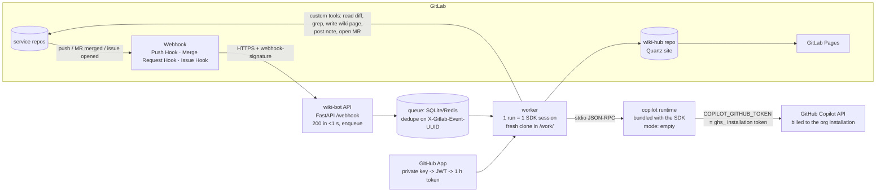

# ADR-03: Central wiki-bot service built on the GitHub Copilot SDK, driven by GitLab webhooks

<!--
Uniform template for all approach ADRs in llm-wiki/approaches/.
Keep ALL headings, in this order, with these numbers. Add sub-sections freely.
Target length: 250-600 lines. Prefer tables and short paragraphs.
Mark unverified claims with ❓ and say what would verify them.
Never invent product features, URLs, or paper titles; if a search finds nothing, say so.
-->

## 1. Summary
A small long-running internal service (Python, FastAPI + `github-copilot-sdk`) receives GitLab webhooks (push to default branch, merge-request merged, issue opened from a "Wiki request" template), clones the affected repository into a scratch directory, runs one Copilot agent session per event with custom GitLab tools, a deny-listing `onPreToolUse` hook and an AI-credit budget, and pushes a `wiki/*` branch plus a merge request (or a direct commit for docs-only changes under a size threshold). One deployment serves every repository and also maintains a hub repository (service catalogue, contracts, cross-repo index) that is published with Quartz on GitLab Pages. The building blocks are GitHub's Copilot SDK (technical preview 2026-01-22, GA 2026-06-02, MIT, "the same engine behind Copilot CLI") [S1][S2][S3], Karpathy's LLM-wiki loop (ingest / query / lint) [S40], and GitLab's webhook, description-template and REST APIs [S27]–[S38]; the only public precedent for "GitLab webhook → Copilot" is a Flask relay that starts a GitLab CI pipeline running Copilot CLI [S39]. Verdict for us: the strongest *execution model* among the Copilot-based options because (a) the SDK documents an organisation-billed, seat-free credential path (GitHub App installation token) that explicitly covers "other CI systems and services" [S6], which is the cleanest answer so far to the R6 bot-seat problem, and (b) a webhook service is the only model that gives hook-triggered updates (R4), a form (R5) and a cross-repo view (R3) in one place; the price is that we operate a service, and two GitHub-side facts (the `Copilot Requests` App permission and the organisation policy that gates it) could not be cross-verified on GitHub's own docs pages today (❓, section 11).

## 2. Context
- R4 asks for a commit/push-triggered agent that updates the wiki and commits the result; R5 asks for a form-like retry/instruction channel; R3 asks for cross-repo knowledge. `../background/problems-and-fixes.md` lists the webhook service (execution model **WH**) as the model that naturally meets all three and identifies its specific risks: loops (P06), injection with credentials on the runner (P09, P21), cost (P08) and the bot-seat licence question (P20).
- R6 (Copilot only, no API keys) and R7 (GitLab, not GitHub) are where sibling approaches lose points: running Copilot CLI in GitLab CI (ADR-02, ADR-08) needs a fine-grained PAT of a seat-holding account, and GitHub itself says that PAT automation "introduces operational and security risks for organizations running automations at scale" [S8]. This ADR investigates whether the SDK's server-to-server path changes that picture.
- The Copilot SDK became GA in June 2026 with six language bindings and "flexible authentication: GitHub OAuth, GitHub Apps, environment tokens, and BYOK" [S2]; its setup docs now contain explicit guides for "backend services", "multi-tenancy" and "scaling" [S17]–[S19], i.e. exactly the deployment shape this ADR needs.
- The content model is deliberately kept identical to ADR-07 (OKF-style frontmatter, AGENTS.md pointers) and ADR-08 (deterministic backbone + narrative), so that ADR-03 is an execution model that can carry either; ADR-10 (GitLab Duo) is the migration target if R6 is ever amended.

## 3. The approach
### 3.1 Origin and provenance
| Item | Fact | Source |
|---|---|---|
| Copilot SDK | Announced as technical preview 2026-01-22 for Node.js, Python, Go, .NET: "take the same Copilot agentic core that powers GitHub Copilot CLI and embed it in any application" | [S1] [fetched] |
| GA | 2026-06-02: "GitHub Copilot SDK is now generally available"; Rust and Java added; "Available to all existing GitHub Copilot subscribers, including Copilot Free for personal use, and to non-Copilot users via BYOK" | [S2] [fetched] |
| Licence, status | MIT; README FAQ: "Generally available and follows semantic versioning"; "A GitHub Copilot subscription is required … unless you are using BYOK" | [S3] [fetched] |
| Packages | `npm install @github/copilot-sdk` (Node `^20.19.0 \|\| >=22.12.0`), `pip install github-copilot-sdk` (Python 3.11+), `go get github.com/github/copilot-sdk/go`, `dotnet add package GitHub.Copilot.SDK`, Maven `com.github:copilot-sdk-java`, `cargo add github-copilot-sdk`; Node/Python/.NET bundle the CLI runtime, Go/Java/Rust need `copilot` on PATH | [S3], [S4], [S5] [fetched] |
| Release cadence | Releases page lists `v1.0.11` ("production release consolidating SDK improvements across all six language bindings") followed by `v1.0.12-preview.0` … `v1.0.13-preview.4` (rewind, session-scoped token providers, plugin directories). The fetch rendered the years as 2024, which is inconsistent with the June-2026 GA; treat exact dates as ❓ and read the page directly before pinning | [S22] [fetched] |
| Protocol | SDK ↔ CLI is JSON-RPC over stdio or TCP (in-process FFI experimental); "The SDK supports protocol versions 2 through 3" with automatic adapters for a v2 CLI; `client.getStatus()` returns `protocolVersion` | [S16], [S23] [fetched] |
| Activity | Issue tracker active (issues #2459–#2477 updated at fetch time); official docs mirrored under `docs.github.com/en/copilot/how-tos/copilot-sdk/*` (getting-started, auth, features, hooks, setup, observability, troubleshooting) | [S24], [S25] [fetched] |
| Precedent for the relay pattern | `satomic/gitlab-copilot-coding-agent`: "A fully automated coding agent powered by GitHub Copilot CLI and GitLab CI/CD"; a "Flask-based relay service that captures GitLab events" and triggers a pipeline that runs Copilot CLI with a fine-grained PAT ("Copilot Requests") stored as a CI variable; triggers on issue assignment, `@copilot-agent` MR comments, reviewer assignment; ~42 stars per ADR-10 | [S39] [fetched] |
| Wiki pattern | Karpathy's gist: the LLM "incrementally builds and maintains a persistent wiki"; ingest / query / lint; `index.md` + append-only `log.md`; "A single source may update 10-15 wiki pages" | [S40] [fetched] |
| Composition | No public project was found that combines the Copilot SDK with a GitLab-hosted repository wiki; this ADR is a composition of the pieces above, not an existing product (search budget was exhausted before this task; only primary pages were opened, so a small project may exist ❓) | — |

### 3.2 How it works (architecture)

- **Components.** (1) HTTP endpoint that validates the GitLab signature and enqueues; (2) worker pool that performs one run per event; (3) Copilot runtime spawned per run by the SDK (default `RuntimeConnection.forStdio()`; a shared `copilot --headless --port` server is the alternative [S17]); (4) token minter for the GitHub App installation token; (5) GitLab REST client used by the custom tools; (6) hub repository with the cross-repo pages and the Quartz site.
- **Where the LLM runs.** Only inside the Copilot runtime; the service never calls a model API directly and BYOK is not used (R6). Model is pinned per run (`model="…"`), reasoning effort optional [S5][S20].
- **Who authenticates.** The GitHub App installation owned by the company's GitHub organisation (the one that already pays for Copilot Business): "Use a short-lived installation access token when a service needs to make Copilot requests on behalf of an organization without a user's credentials"; "Usage is attributed and billed to the account that owns the GitHub App installation" [S6]. Fallback: a fine-grained PAT of a machine account with a seat (section 5, R6).
- **What triggers a run.** Push Hook on the default branch, Merge Request Hook with `object_attributes.action == "merge"`, Issue Hook with `action` in `{open, update}` and label `wiki::request` [S28]. A nightly scheduled lint is triggered by a GitLab scheduled pipeline that calls the service's `/lint` endpoint (or by the service's own cron).
- **What is written and committed.** Only `docs/wiki/**`, `AGENTS.md` managed block and `llms.txt` in the service repo; `catalog/**`, `contracts/**`, `index.md` in the hub repo. The bot pushes a `wiki/<run-id>` branch and opens an MR (D05); a docs-only diff under a configured size may be auto-merged by a GitLab merge-request approval rule (documented workaround, not default).

### 3.3 Wiki content model it implies
| Layer | Location | Owner | Notes |
|---|---|---|---|
| Schema | `docs/wiki/SCHEMA.md` + `AGENTS.md` managed block + `.github/copilot-instructions.md` shim | humans | Same file set as ADR-07 §4; the service loads the schema as the session's `system_message` (mode `append`) and as a skill directory (`skill_directories=["docs/wiki/.skills"]`) [S14][S20]. |
| Agent-facing pages | `docs/wiki/{overview,modules,flows,contracts,decisions}/*.md` | agent (`owner: agent`) | Frontmatter per D01 (`source_commit`, `sources`, `owner`, `audience`, `confidence`, `schema_version`), OKF-style `type`, `generated`, `verified`, `stale_after` (ADR-07). Every claim cites a code path (D12). |
| Human/PO pages | `docs/wiki/po/*.md`, `docs/wiki/runbooks/*.md` | humans (`owner: human`) | Agent may only append "since last release" sections (D20); the `onPreToolUse` hook denies writes elsewhere (section 4.4). |
| Index / log | `docs/wiki/index.md` (generated from frontmatter by a script in the service, never by the model, D06), `docs/wiki/log.md` (append-only, `merge=union`) | script / agent | Log entries record the trigger (`process:wiki-bot/<run-id>`, event UUID, issue IID). |
| Cross-repo | hub repo: `catalog/services.md`, `contracts/<api>.md`, `events/<topic>.md`, `owners.md`, root `index.md` | service (deterministic) + agent (narrative) | Vocabulary `provides: [api:orders.v2]`, `consumes: [event:order.created]` validated by the service (P23). |

### 3.4 Trigger and automation model
| Concern | Design | Evidence |
|---|---|---|
| Event intake | Group webhook (Premium/Ultimate) or one project webhook per repo (Free); events: push (branch filter = default branch), merge requests, issues; secret = signing token | "Group webhooks … Tier: Premium, Ultimate"; push events can be filtered "by the branch name"; "For new webhooks, use a signing token instead of a secret token" [S27] |
| Signature check | Verify `webhook-signature` (`v1,{base64}` HMAC-SHA256 over `{message_id}.{timestamp}.{body}`, GitLab 19.0+); on older self-managed instances fall back to `X-Gitlab-Token` | [S27] [fetched] |
| Ack fast, work later | Return 200 immediately and enqueue; GitLab: "Avoid processing webhooks in the same request. Use a queue"; webhooks are "temporarily disabled if they fail four consecutive times" (1 min → up to 24 h) and "permanently disabled if they fail 40 consecutive times"; self-managed default timeout 60 s (`gitlab_rails['webhook_timeout']`) | [S27], [S38] [fetched] |
| Idempotency | Deduplicate on `X-Gitlab-Event-UUID` / `Idempotency-Key` ("consistent across webhook retries"); manual "Resend Request" from the Recent-events log (last two days) replays with the same key | [S27] |
| Debounce / batching | One run per repo per 5-minute window; a push of N commits produces one run against `checkout_sha`; payload lists at most 20 commits, so the worker diffs `before..after` itself, not the payload | "If you push more than 20 commits at once, the commits attribute … contains information about the newest 20 commits only" [S28] |
| Loop prevention | Ignore events whose `user_username` is the bot user (`project_<id>_bot_*` / `group_<id>_bot_*`) and whose changed paths are all under `docs/wiki/`; bot commits carry `[skip wiki]`; the wiki MR touches docs paths only (D04, D09) | bot naming [S33][S34]; D04 (`../background/problems-and-fixes.md`) |
| Concurrency | Per-repo mutex in the queue; global worker pool of N (start with 2); one SDK session = one child runtime process, so runs are isolated by OS process and scratch directory | SDK scaling doc: "No built-in session locking", "Enforce concurrency limit" [S19] |
| Merge conflicts | Worker always clones the current default branch and edits section-wise (D08); `index.md` regenerated from frontmatter (D06); if the MR from a previous run is still open, the new run rebases that branch instead of opening a second MR | P05 |
| Retry semantics | Transient `session.error` (`statusCode` 429/5xx) → exponential backoff, max 3 attempts; hard failure → issue note / MR comment with the run id and a `wiki::failed` label; a run is resumable via `resume_session(session_id)` for post-mortem, and the persisted transcript is kept 14 days | events `session.error {errorType, message, statusCode?}`, `session.idle` "Always emitted when the tool-use loop ends" [S12][S15]; persistence [S11] |
| Budget | `session_limits={"max_ai_credits": N}`: "Usage is checked after model calls return, so one response can exceed the configured value before the runtime blocks the next model call"; the worker answers `session_limits_exhausted.requested` with *stop*, commits what exists as a draft MR, and labels it `wiki::budget` | [S9] [fetched] |

### 3.5 Human retry / instruction channel ("the form")
The form is a GitLab **issue description template** plus labels; no prompt code is edited.
- `.gitlab/issue_templates/Wiki request.md` (per repo, or a group-level template on Premium/Ultimate) with task-list checkboxes and a quick action `/label ~"wiki::request"`; "The quick actions are only executed if the user submitting the issue … has the permissions" [S29][S30]. A link `…/issues/new?issuable_template=Wiki%20request` pre-selects it [S29].
- The Issue Hook payload carries `object_attributes.description`, `labels[]` and `changes` [S28]; the service parses the checkboxes (`- [x] Re-run full update`, `- [x] Explain for the product owner`) and the free-text "Instructions" section, strips hidden Unicode/HTML comments and passes it inside a delimited *untrusted* block (D14).
- Progress and result are posted as issue notes (`POST /projects/:id/issues/:issue_iid/notes`, `body`, optional `internal`) and the issue is relabelled `wiki::running` → `wiki::done` / `wiki::failed` via `PUT /projects/:id/issues/:issue_iid` with `add_labels` / `remove_labels` [S31][S32].
- Retry = re-apply the label or comment `/label ~"wiki::request"`; the Issue Hook `update` event with `changes.labels` triggers a new run.
- Poor-man's form without the daemon: a manual pipeline in the hub project with prefilled variables (`variables: WIKI_TARGET: {description: …, options: […]}`) [S37]; less discoverable, but useful during the spike.

### 3.6 Multi-repo / microservice fit
- **Per-repo wiki + central hub.** Each service repo keeps its own `docs/wiki/` (agents working in that repo find it via `AGENTS.md`); the service writes the hub repo's catalogue and contract pages from frontmatter and OpenAPI/AsyncAPI files (deterministic step first, narrative second, as in ADR-08).
- **Onboarding a repo** = add the webhook (or nothing, with a group webhook), add the bot as Developer (group access token → one bot user for the whole group; "non-billable users and do not count towards your license limit" [S34]), copy the issue template, add three lines to `wiki-bot/config/repos.yaml` (project id, default branch, exclusions). No per-repo CI change is required (P16).
- **Cross-repo answers** ("who consumes `event:order.created`?") come from the hub index, generated without an LLM (P23); the agent session gets a `search_hub` custom tool that greps the hub clone.
- **Ownership** from each repo's `CODEOWNERS` → `owners.md` in the hub.
- **Future autonomous agents** (R3): the service exposes the same custom tools through an MCP server (`mcp_servers` config on any Copilot session [S10]), so a coding agent can `lookup_wiki` instead of reading the index; the hub site also emits `llms.txt` (ADR-07).

### 3.7 Publishing / UI
The hub repo contains a Quartz v5 site; Quartz documents GitLab Pages with `image: node:24`, `npm ci`, `npx quartz build`, artifacts `public/` [S36]. The service pushes wiki content into `hub/content/<repo>/` (a plain copy of each repo's `docs/wiki/`, plus the catalogue), and the hub pipeline builds Pages on push. Pages access control ("Only project members") is available on every tier, on self-managed only if the administrator enabled it [S35]. Per-repo sites are not needed; agents read the Markdown in git, humans read Pages (R8 🟡 because the aggregation pipeline is custom and Quartz's `baseUrl` handling for Pages sub-paths must be checked ❓).

## 4. Concrete implementation sketch for our environment
Assumptions relied on (from `../requirements.md`): a container can run in company infrastructure with outbound HTTPS to GitLab, `api.github.com` and the Copilot endpoints; a GitLab group access token can be created (GitLab.com: Premium/Ultimate; self-managed: any licence [S33][S34]); the company's GitHub organisation holds the Copilot Business subscription and an org owner can create/install a GitHub App.

### 4.1 Repository layout of the service
```
wiki-bot/
├── Dockerfile
├── pyproject.toml            # fastapi, uvicorn, github-copilot-sdk, pydantic, httpx, PyJWT, python-gitlab (optional)
├── config/
│   ├── repos.yaml            # allow-list: project_id, path_with_namespace, default_branch, exclude globs, budget
│   └── models.yaml           # pinned model per task (update / lint / bootstrap) (D21)
├── wikibot/
│   ├── api.py                # /webhook, /healthz, /lint (auth: signing token / bearer)
│   ├── queue.py              # SQLite-backed queue, dedupe on event UUID, per-repo lock
│   ├── worker.py             # run loop: clone -> plan -> session -> verify -> push -> MR/notes
│   ├── copilot_auth.py       # GitHub App JWT -> installation token (1 h), refresh
│   ├── agent.py              # SDK session: system message, tools, hooks, limits
│   ├── tools.py              # custom tools (read_diff, grep_repo, read_wiki, write_wiki_page, search_hub)
│   ├── gitlab.py             # REST: notes, labels, MR create, project info
│   ├── verify.py             # frontmatter lint, path allow-list, secret scan, index regeneration (D01, D06, D09, D16)
│   └── prompts/              # versioned task prompts: update.md, lint.md, bootstrap.md, form.md
└── skills/wiki-maintain/SKILL.md   # loaded via skill_directories (same skill as ADR-07 §4.5)
```

### 4.2 Copilot authentication: GitHub App installation token (`copilot_auth.py`)
Documented path [S6][S21]: create a GitHub App with the **Copilot Requests** permission set to **Read & write** ❓ (the SDK doc calls it a *repository* permission; the REST "permissions required for GitHub Apps" page fetched today lists other Copilot permissions but not this one — verify in the App settings UI), install it on the organisation ("All repositories"), and make sure "The organization must be enabled for Copilot requests from GitHub App installations" ❓ (policy name/location not found on the organisation policies page fetched today; for Actions the policy is called "Allow use of Copilot CLI billed to the organization" [S8]).
```python
# copilot_auth.py — mint a 1-hour installation token; "Installation tokens expire after one hour." [S6]
import time, jwt, httpx

def app_jwt(app_id: str, private_key_pem: str) -> str:
    now = int(time.time())
    return jwt.encode({"iat": now - 60, "exp": now + 540, "iss": app_id}, private_key_pem, algorithm="RS256")

def installation_token(app_id, private_key_pem, installation_id, placeholder_repo_id) -> tuple[str, float]:
    r = httpx.post(
        f"https://api.github.com/app/installations/{installation_id}/access_tokens",   # [S21]
        headers={"Authorization": f"Bearer {app_jwt(app_id, private_key_pem)}",
                 "Accept": "application/vnd.github+json"},
        json={"repository_ids": [placeholder_repo_id],          # the SDK doc's example body [S6]
              "permissions": {"copilot_requests": "write"}},
        timeout=20,
    )
    r.raise_for_status()
    return r.json()["token"], time.time() + 55 * 60          # refresh at 55 min, then restart the client
```
Notes: the token is passed to the runtime as `COPILOT_GITHUB_TOKEN` in `env`, **not** through `github_token` ("Do not pass an installation token through the SDK's `gitHubToken`") and `use_logged_in_user=False` [S6]. `repository_ids` needs at least one repository in the GitHub org (an empty placeholder repo is enough ❓ — the code lives on GitLab and is never pushed to GitHub).

### 4.3 Webhook handler outline (`api.py`)
```python
# api.py
import base64, hashlib, hmac, os
from fastapi import FastAPI, Header, HTTPException, Request
from wikibot.queue import enqueue

app = FastAPI()
SIGNING_TOKEN = os.environ["GITLAB_WEBHOOK_SIGNING_TOKEN"]

def verify(body: bytes, sig: str | None, msg_id: str | None, ts: str | None, legacy: str | None) -> None:
    if sig and msg_id and ts:                       # GitLab >= 19.0 signing token [S27]
        expected = hmac.new(SIGNING_TOKEN.encode(),
                            f"{msg_id}.{ts}.{base64.b64encode(body).decode()}".encode(),   # ❓ confirm exact canonical form on a real delivery
                            hashlib.sha256).digest()
        if not hmac.compare_digest("v1," + base64.b64encode(expected).decode(), sig):
            raise HTTPException(401)
    elif legacy and hmac.compare_digest(legacy, SIGNING_TOKEN):   # X-Gitlab-Token fallback
        return
    else:
        raise HTTPException(401)

@app.post("/webhook")
async def webhook(req: Request,
                  x_gitlab_event: str = Header(...),
                  x_gitlab_event_uuid: str | None = Header(None),
                  idempotency_key: str | None = Header(None),
                  webhook_signature: str | None = Header(None),
                  webhook_message_id: str | None = Header(None),      # ❓ header names for message id / timestamp
                  webhook_timestamp: str | None = Header(None),
                  x_gitlab_token: str | None = Header(None)):
    body = await req.body()
    verify(body, webhook_signature, webhook_message_id, webhook_timestamp, x_gitlab_token)
    ev = await req.json()
    key = idempotency_key or x_gitlab_event_uuid
    match x_gitlab_event:                                           # header values [S28]
        case "Push Hook":
            if ev["ref"] == f"refs/heads/{default_branch(ev['project']['id'])}" and not is_bot(ev["user_username"]):
                enqueue(kind="update", key=key, project=ev["project"]["id"], sha=ev["after"], before=ev["before"])
        case "Merge Request Hook":
            oa = ev["object_attributes"]
            if oa["action"] == "merge" and oa["target_branch"] == default_branch(ev["project"]["id"]):
                enqueue(kind="update", key=key, project=ev["project"]["id"], sha=oa["merge_commit_sha"], mr_iid=oa["iid"])
        case "Issue Hook":
            oa = ev["object_attributes"]
            labels = {l["title"] for l in ev.get("labels", [])}
            if "wiki::request" in labels and oa["action"] in ("open", "update"):
                enqueue(kind="form", key=key, project=ev["project"]["id"], issue_iid=oa["iid"], text=oa["description"])
    return {"queued": True}          # respond fast; GitLab disables hooks after 4 consecutive failures [S27]
```

### 4.4 Agent run (`agent.py`) — one SDK session per event
```python
# agent.py
import asyncio, os
from pydantic import BaseModel, Field
from copilot import CopilotClient, define_tool
from copilot.session import PermissionHandler
from copilot.session_events import SessionIdleData, SessionErrorData        # ❓ exact class names beyond AssistantMessageData/SessionIdleData

WIKI_ALLOW = ("docs/wiki/", "AGENTS.md", "llms.txt")

class WritePage(BaseModel):
    path: str = Field(description="Repo-relative path under docs/wiki/")
    content: str = Field(description="Full page content incl. frontmatter")

@define_tool(description="Write or replace a wiki page (agent-owned pages only)")
async def write_wiki_page(p: WritePage) -> str:
    if not p.path.startswith("docs/wiki/") or p.path.startswith("docs/wiki/po/"):
        return "DENIED: outside agent-owned wiki paths"
    ...  # write into the run's clone; verify.py checks frontmatter before commit
    return "ok"

class Diff(BaseModel):
    before: str; after: str

@define_tool(description="Unified diff of the triggering change, secrets redacted, max 4000 lines")
async def read_diff(p: Diff) -> str: ...

async def on_pre_tool_use(input_data, invocation):          # hook signature per SDK docs [S13]
    name, args = input_data["toolName"], input_data.get("toolArgs", {})
    if name in ("shell", "bash"):                             # ❓ confirm built-in tool ids via session.rpc / a dry run
        cmd = str(args.get("command", ""))
        if any(x in cmd for x in ("git push", "curl ", "wget ", "ssh ", "rm -rf", "chmod")):
            return {"permissionDecision": "deny", "permissionDecisionReason": "network/destructive commands are blocked"}
    if name in ("write_file", "delete_file") and not str(args.get("path", "")).startswith(WIKI_ALLOW):
        return {"permissionDecision": "deny", "permissionDecisionReason": "only docs/wiki/** may be edited"}
    return {"permissionDecision": "allow"}

async def run(run_id: str, clone_dir: str, task_prompt: str, token: str, model: str, budget: int) -> dict:
    client = CopilotClient(
        mode="empty",                                        # "In multi-user server mode, this is the safe baseline." [S18]
        env={**os.environ, "COPILOT_GITHUB_TOKEN": token, "COPILOT_PLUGIN_DIR_ONLY": "true"},   # [S6][S14b]
        use_logged_in_user=False,
        base_directory=f"/var/lib/wikibot/copilot-home",     # COPILOT_HOME; session-state persisted here [S11]
        log_level="info",
        telemetry={"otlp_endpoint": os.environ.get("OTEL_EXPORTER_OTLP_ENDPOINT")},   # ❓ Python TelemetryConfig field names [S16]
    )
    await client.start()
    try:
        session = await client.create_session(
            session_id=run_id,                                # meaningful id -> resumable for post-mortem [S11]
            model=model,
            working_directory=clone_dir,                      # tool operations relative to the clone [S20]
            system_message={"mode": "append", "content": open("wikibot/prompts/system.md").read()},   # ❓ field names
            skill_directories=["skills/wiki-maintain", f"{clone_dir}/docs/wiki/.skills"],
            tools=[read_diff, write_wiki_page, grep_repo, read_wiki, search_hub],
            available_tools=["custom:*", "read_file", "list_directory", "search_files"],   # ❓ built-in ids; pattern syntax per SDK
            hooks={"on_pre_tool_use": on_pre_tool_use},
            on_permission_request=PermissionHandler.approve_all,   # allowed only because hooks + available_tools fence the session
            session_limits={"max_ai_credits": budget},        # soft cap [S9]
            streaming=False,
        )
        usage = {"credits": 0.0, "calls": 0}
        def on_event(ev):
            if ev.type == "assistant.usage":                  # per model call: model, inputTokens, outputTokens, cost [S12]
                usage["calls"] += 1
            if ev.type == "session_limits_exhausted.requested":
                ...  # answer "stop" -> draft MR labelled wiki::budget
        session.on(on_event)
        await session.send_and_wait(task_prompt, timeout=1800)    # returns on session.idle [S15]
        metrics = await session.rpc.usage.get_metrics()       # totalNanoAiu / 1e9 = AI credits ❓ Python method name
        usage["credits"] = (metrics.get("totalNanoAiu") or 0) / 1e9
        return usage
    finally:
        await client.stop()
```
Task prompts (`prompts/update.md`) contain the diff and the list of pages whose `sources` intersect the changed files (computed by `verify.py` before the session; if the list is empty the run exits without a model call — D07). Commit messages, MR descriptions and issue text are never pasted raw (D14). After the session, `verify.py` regenerates `index.md`, validates frontmatter, runs a secret scan and rejects any change outside the allow-list; only then does the worker push `wiki/<run-id>` and call `POST /projects/:id/merge_requests` (`source_branch`, `target_branch`, `title`, `description`, `remove_source_branch`) — the same call OpenWiki's GitLab example uses [S41] (full parameter list on the MR API page was not reachable today ❓).

### 4.5 Issue template (`.gitlab/issue_templates/Wiki request.md`)
```markdown
<!-- Wiki bot request. Keep the checkboxes; the bot parses them. -->
/label ~"wiki::request"
/assign @wiki-bot-group

**What should the wiki bot do?**
- [ ] Re-run the update for the latest default branch
- [ ] Full re-bootstrap of this repository's wiki (expensive; needs maintainer approval)
- [ ] Lint pass (contradictions, stale claims, broken links)
- [ ] Explain something for the product owner (non-technical page)

**Scope (optional)**
Paths or modules: 

**Instructions** (free text, treated as untrusted input by the bot)


**Budget**
- [x] default (config)   - [ ] up to 2x default
```
The `/label` and `/assign` quick actions execute on creation when the submitter has permission [S29][S30]; whether the labels applied by a template quick action are already present in the `open` Issue Hook payload, or arrive as a separate `update` event, must be checked on a real instance ❓ (the handler above accepts both).

### 4.6 Deployment notes
```dockerfile
# Dockerfile — "There is no official pre-built Docker image for the Copilot CLI" [S17]; the Python SDK bundles the runtime
FROM python:3.12-slim
RUN apt-get update && apt-get install -y --no-install-recommends git ca-certificates && rm -rf /var/lib/apt/lists/*
RUN useradd -m wikibot
WORKDIR /app
COPY pyproject.toml . && pip install --no-cache-dir .        # installs github-copilot-sdk
RUN su wikibot -c "python -m copilot download-runtime"       # pre-fetch the bundled CLI runtime at build time [S4]
COPY . .
USER wikibot
ENV COPILOT_HOME=/var/lib/wikibot/copilot-home
VOLUME ["/var/lib/wikibot"]                                   # session-state + queue must be persistent [S11]
CMD ["uvicorn", "wikibot.api:app", "--host", "0.0.0.0", "--port", "8080"]
```
- **Secrets** (mounted, never in the image): GitHub App id + private key; GitLab group access token (`api`, `write_repository`, role Developer); webhook signing token. No deploy credentials of any kind on the host (D15).
- **Network policy**: egress only to the GitLab host, `api.github.com` and the Copilot API host(s) ❓ (hostnames not documented on the pages fetched; capture them in the spike with `tcpdump`/proxy logs).
- **Sizing**: 2 vCPU / 4 GB for two concurrent runs; each run spawns one runtime process and a clone; scratch under `/work/<run-id>` deleted after push.
- **Process model choice**: per-run stdio child (default, strongest isolation, no shared server) versus one `copilot --headless --host 0.0.0.0 --port 4321` server shared by workers (lighter, but "Single CLI server is a point of failure", "No built-in authentication between SDK and CLI", "Session state persists on local disk only") [S17]. Start with per-run children.
- **Observability**: OTLP export via `TelemetryConfig` (`otlp_endpoint`, protocol `http/json|http/protobuf`, `capture_content` off in production) [S16]; per-run metrics from `assistant.usage` and `session.usage_checkpoint` (`totalNanoAiu`) [S12]; account quota via `account.getQuota` [S12]; a `/metrics` endpoint with runs, failures, credits per repo; the persisted session directory is the audit transcript.
- **Poor-man's alternative (no daemon)**: keep the same `worker.py` but run it as a GitLab CI job in the hub project: (a) scheduled pipeline every 15 min that lists `wiki::request` issues via `GET /projects/:id/issues?labels=wiki::request&state=opened` and default-branch commits since the last run; (b) manual pipeline with prefilled variables as the form [S37][S31]. The installation-token path works there too (the S2S doc's "other CI systems" section) [S6]. This loses sub-minute latency and cross-repo state in memory, but removes the service; it is also the fallback if a container cannot be hosted. A middle ground is the satomic-style stateless relay that only calls `POST /projects/:id/trigger/pipeline` with `variables[...]` [S39][S36b].

## 5. Requirements check
Use exactly these IDs and the legend from `../requirements.md`.

| ID | Requirement (short) | Rating | Evidence / notes |
|----|---------------------|--------|------------------|
| R1 | Dual audience (agents + devs + PO) | ✅ | Content model 3.3 separates agent pages, developer pages and `owner: human` PO pages; the form (3.5) has an explicit "explain for the product owner" request; the hook blocks agent writes to PO pages. Content quality itself is the same open problem as in every ADR (P14). |
| R2 | Context layer for whole AI dev pipeline | ✅ | Wiki in git + `AGENTS.md` pointer for coding agents (D10/D11); `lookup_wiki`/`search_hub` exposed as MCP tools for agents at any stage (`mcp_servers` on a session [S10]); per-stage pages as in ADR-07 §4.8. |
| R3 | Multi-repo microservices, future autonomous agents | ✅ | One service, group webhook or per-project hooks, one bot user per group [S27][S34]; hub with deterministic catalogue/contract index (P23); tools reusable by future agents through MCP; SDK supports custom agents / sub-agents (`custom_agents`, fleet mode) [S10][S7]. |
| R4 | Bootstrap once, dev-owned upkeep, hook-triggered auto-update | ✅ | Push/MR-merge webhooks are server-side hooks (no client-hook bypass, P18); bootstrap is a `kind=bootstrap` run with its own budget (P17); developers own content through MR review of `wiki/*` branches (D05). |
| R5 | Human retry / instructions via a form | ✅ | GitLab issue template with checkboxes + `/label` quick action → Issue Hook → run; status via notes and labels [S28]–[S32]. Manual pipeline variables as fallback [S37]. |
| R6 | Copilot-only (no API keys, no direct model access) | 🟡 | Only Copilot runs the model; BYOK unused. The SDK documents an org-attributed, seat-free credential for "other CI systems and services": GitHub App installation token with `copilot_requests: write`, "billed to the account that owns the GitHub App installation" [S6][S21]. **Unverified** ❓: the `Copilot Requests` App permission is not on the REST permissions page [S26b] and the gating org policy is not on the org-policies page [S26]; the March-2026 Generative AI Services Terms are silent on automation, and the old Product Specific Terms were deprecated 2026-03-05 [S43][S44]; Copilot plan required for org-billed installations not stated (assume Business/Enterprise). Fallback: fine-grained PAT (`Copilot Requests`) of a machine account with a seat — GitHub ToS allows one machine account per person [S42], seat docs say seats are "assigned to a unique user account" and are silent on machine accounts [S45], and GitHub warns PAT automation "introduces operational and security risks … at scale" [S8]. Needs written confirmation (D22). |
| R7 | GitLab, not GitHub | ✅ | All triggers, tokens, form, MRs and Pages are GitLab features [S27]–[S38]. GitHub is used only as the Copilot auth/billing tenant (the GitHub App is installed on the org; no code is pushed to GitHub). GitLab.com Free tier lacks group webhooks and project/group access tokens → per-project webhooks and a personal token of a dedicated GitLab user instead (workaround) [S27][S33][S34]. |
| R8 | UI on GitLab Pages (Quartz) | 🟡 | Quartz documents GitLab Pages [S36]; hub aggregation is custom (service copies each repo's wiki into the hub); Pages access control on all tiers [S35]; `baseUrl`/sub-path behaviour unverified ❓. |

## 6. Pros
- **Cleanest R6 story among Copilot approaches**: a documented, org-billed, seat-free token path that GitHub itself describes for "other CI systems and services" [S6]; usage draws on the pooled Copilot Business credits (1,900 per user per month, pooled; 1 credit = $0.01; budgets per user/cost centre/org) [S46].
- **Server-side trigger**: cannot be bypassed with `--no-verify` (P18), no latency in the developer's commit path (P07), one writer per repo (P05).
- **Form and retry are first-class**: issue template + labels + notes, all GitLab-native (R5).
- **Cross-repo view for free**: the same process sees every repo and maintains the hub (R3).
- **Fine-grained control not available to `copilot -p`**: per-run `available_tools`, `onPreToolUse` deny/modify, `session_limits.max_ai_credits`, `mode="empty"` (no ambient host skills/MCP), per-session `working_directory`, OpenTelemetry, resumable sessions [S9][S13][S18][S20][S11][S16].
- **Small blast radius per run**: fresh clone, child runtime process, no deploy secrets on the host, MR gate.
- **Language fit**: Python SDK (owner uses PyCharm); TypeScript identical in shape [S4][S5].
- **Degrades to CI**: the worker is a plain async function; it runs unchanged as a scheduled GitLab job if the daemon is not wanted (4.6).

## 7. Cons and risks
- **Two unverified GitHub facts** (App permission, org policy) and no explicit terms language on automation — the whole R6 advantage rests on one SDK doc page; if the App path is not available on the company's plan, ADR-03 falls back to the same machine-account seat question as ADR-02/ADR-08 (P20).
- **We operate a service**: availability, secrets rotation (App private key, GitLab token), upgrades of SDK + runtime (protocol v2/v3 adapters exist [S23], but preview tags keep shipping after GA [S22]), and GitLab's auto-disable of webhooks after four failures [S27] means an outage silently stops updates until someone re-enables the hook.
- **Injection surface with credentials**: the service holds a GitLab write token and reads untrusted content (diffs, issue text); the mitigations (D14, D15, hook deny-list, allow-listed paths, MR gate) are necessary, not optional (P09, P21). The `available_tools` / built-in tool ids must be confirmed in the spike ❓.
- **Cost is usage-metered and only softly capped**: "one response can exceed the configured value before the runtime blocks the next model call" [S9]; a bootstrap on a large repo can consume a large share of the pooled credits (P08, P17).
- **GitHub org dependency**: the company needs an org owner to create/install the App and enable the policy; every token mint touches `api.github.com` (1-hour lifetime) — an extra external dependency in the update path.
- **Tier gaps on GitLab.com Free**: no group webhooks, no group/project access tokens [S27][S33][S34]; self-managed is fine on any licence.
- **Not a product**: no community, no upgrade path from a vendor; compare ADR-10 (GitLab Duo flows) which has first-party triggers but violates R6.
- **Data residency**: Copilot data residency (US/EU) is documented for Enterprise Cloud with data residency and adds +10% credit cost; whether it applies to org-billed App installations on Business is ❓ (`../background/problems-and-fixes.md` P20).

## 8. Known problems reported by practitioners, and fixes
| Problem | Where reported | Fix / mitigation here |
|---|---|---|
| Copilot CLI/SDK automation with a user PAT bills a person's seat and "introduces operational and security risks for organizations running automations at scale" | GitHub docs [S8] | Use the org-installed GitHub App token (4.2); PAT only for the spike. |
| Installation tokens expire after one hour; the SDK doc says to mint a new one and restart the client | SDK auth doc [S6] | One client per run (runs are shorter than 1 h) or refresh at 55 min; long bootstraps are split into resumable page jobs (P17). |
| "No official pre-built Docker image for the Copilot CLI"; headless server is a single point of failure with no SDK↔CLI auth; session state on local disk only | SDK backend-services doc [S17] | Per-run child runtime, persistent volume for `COPILOT_HOME`, service on an internal network only. |
| Default `copilot-cli` mode loads ambient host config; multi-tenant guidance: `mode: "empty"`, never share one token across users, do not trust client-supplied session ids, avoid `builtin:*` | SDK multi-tenancy doc [S18] | `mode="empty"`, run ids generated server-side, explicit `available_tools`. |
| Plugin directories provided by the host trigger read-permission prompts (issue #2477, open); resumed sessions replay a text-less assistant turn as `content: null` on some providers (issue #2469, open) | SDK issue tracker [S24] | `approve_all` permission handler fenced by hooks; do not rely on `resume_session` for continuing work, only for post-mortem reading. |
| Webhook endpoint too slow → GitLab disables the hook (4 failures temporary, 40 permanent) | GitLab docs [S27] | Enqueue and return 200 immediately; alert on the GitLab "Recent events" failure count; health check re-enables via API ❓ (endpoint not verified). |
| Push payload truncated to 20 commits | GitLab docs [S28] | Worker diffs `before..after` from the clone. |
| Agent commit re-triggers the agent (P06) | `../background/problems-and-fixes.md` | Ignore bot username + docs-only path filter + `[skip wiki]`; the bot's push with a group token does trigger CI, so the repo's `workflow: rules` should skip on `$GITLAB_USER_LOGIN =~ /^group_\d+_bot_/` (D04). |
| Remote prompt injection through commit messages, MR descriptions and code comments led to source-code theft in GitLab Duo; CVE-2025-53773 made Copilot enable auto-approve and run commands | Legit Security / Embrace The Red via `../background/problems-and-fixes.md` P09 | D14 (no raw free text; strip hidden Unicode/HTML comments), hook deny-list on shell/network, no egress, MR gate, path allow-list checked after the session by `verify.py`. |
| Copilot CLI auto-compacts context at 95% of the window; SDK `infiniteSessions` is on by default | `../background` P03; SDK Node README [S5] | Keep runs small (D07 change-set), one session per run; disable/observe compaction via `session.compaction_*` events [S12]. |
| Webhook-relay precedent runs Copilot CLI in a *separate* agent project's pipeline with a PAT in CI variables | satomic README [S39] | Same relay shape is our "middle ground"; we keep the App token and the MR gate. |

## 9. Scaling considerations
- **Many repos, one service**: throughput is bounded by concurrent runtime processes, not by GitLab; start with 2 workers, scale by adding replicas that share the SQLite/Redis queue; the SDK's scaling doc describes "multiple CLI servers behind a load balancer" with session state on shared storage and warns "No built-in session locking", "No built-in load balancing" [S19] — irrelevant if each run is a child process and session state is only read afterwards.
- **Token budget**: D07 (no model call when no page's `sources` changed) and debouncing keep steady-state cost to roughly one run per merged MR; `max_ai_credits` per run; a separate, larger budget and a resumable page queue for bootstrap (OpenWiki's "resumable page-job architecture" is the model; `../background/landscape.md` §5). Measured cost per run is unknown — ADR-08 assumed ~$1 (100 credits) per run ❓; the spike must measure `totalNanoAiu` per run [S12].
- **Large codebases**: the agent never reads the whole repo; it gets the diff, the affected pages and grep/search tools (P28 in `../background/landscape.md` §7d recommends a code-search tool); exclusions per repo in `repos.yaml`; page-size budgets enforced by `verify.py`.
- **Drift / staleness**: `source_commit` per page + nightly lint run per repo; stale pages are worse than none (P27 in landscape §7d), so `verify.py` marks pages whose `sources` changed since `source_commit` as `stale` even if the run fails.
- **Incremental vs full**: incremental by default (section edits, D08); full regeneration only via the form's "re-bootstrap" checkbox with maintainer approval.
- **Hub index**: generated deterministically from frontmatter (D06); grows linearly with repos; at hundreds of pages add a BM25 search tool (Karpathy's own scale caveat, `../background/landscape.md` §1).

## 10. Effort and cost estimate
| Item | Estimate | Notes |
|------|----------|-------|
| Bootstrap (one-off) | Service MVP 2–3 person-weeks (webhook, queue, clone, session, verify, MR/notes, App token); hub + Quartz 1 week; per-repo bootstrap run 0.5 day of human review + a credit budget set per repo | Bootstrap credits per repo unknown ❓; budget as a project (P17); page-job resumability needed for big repos. |
| Per-commit / per-MR run | Minutes of wall time; credits = tokens × model price (`assistant.usage`, `totalNanoAiu`) [S12]; assume 0.2–2 USD per run until measured ❓ | Debounced to one run per merged MR; nightly lint per repo; D07 skips no-op runs. |
| Ongoing maintenance per week | 2–4 h: SDK/runtime upgrades, prompt/schema MRs, failed-run triage, token rotation | Preview tags still ship after GA [S22]; protocol adapters reduce breakage [S23]. |
| Infrastructure | One container (2 vCPU / 4 GB) + 20 GB persistent volume + optional OTLP collector; GitLab runner minutes only for the hub Pages build | No GPU, no model hosting (R6). |
| Licensing / seats | **Zero extra seats if the App path is confirmed**: usage is metered to the org's pooled AI credits (Business 1,900 credits/user/month, pooled; overage 1 credit = $0.01) [S46]. Fallback: one Copilot Business seat for a machine account (prepaid per seat from 2026-10-01 [S47]) | The seat fallback needs written confirmation (P20, D22); GitLab: group access token bot users are non-billable [S34]; GitLab.com needs Premium/Ultimate for group tokens/webhooks. |

## 11. Open questions and spike plan
| # | Question | Smallest experiment |
|---|---|---|
| Q1 | Does the company's GitHub org (Copilot Business) expose the **Copilot Requests** App permission and the policy for "Copilot requests from GitHub App installations" [S6] ❓ | Org owner creates a GitHub App, looks for the permission in the App settings UI and the policy in the org's Copilot settings; screenshot both. 1 h. |
| Q2 | Does an installation token actually authenticate the SDK from a non-GitHub host and get billed to the org? | Mint a token (4.2) on a laptop, run the getting-started sample with `COPILOT_GITHUB_TOKEN` and `use_logged_in_user=False`, check the org's usage report for an entry with no user. 2 h. |
| Q3 | Is this use permitted under the company's agreement (Generative AI Services Terms are silent [S44])? | Written question to the GitHub account manager quoting [S6] and [S8]; ask specifically about non-GitHub CI and about a machine-account seat as fallback (D22). |
| Q4 | Which built-in tool ids exist in `mode="empty"` and what `available_tools` pattern syntax is accepted? | Create a session with `available_tools=[]` and list tools via `session.rpc` / a probe prompt; confirm hook `toolName` values for shell and file writes. 2 h. |
| Q5 | Exact `webhook-signature` canonicalisation and header names for message id/timestamp; do template quick-action labels appear in the `open` Issue Hook payload? | Point a project webhook at a request-bin; create an issue from the template; diff the two payloads. 1 h. |
| Q6 | Cost per run and per bootstrap on a representative backend repo | Run 10 updates and one bootstrap with `session_limits`; record `totalNanoAiu`, wall time, pages touched. 1 day. |
| Q7 | Does the SDK's per-run child-process model hold at 2–4 concurrent runs on a 2 vCPU container (memory, runtime download caching)? | Load test with synthetic pushes; watch RSS and `/work` usage. 0.5 day. |
| Q8 | Quartz sub-path `baseUrl` on GitLab Pages for the aggregated hub | Build the hub with two repos' content; check links and search. 0.5 day. |
| Q9 | GitLab tier of the company (Free vs Premium; SaaS vs self-managed) — decides group webhook/token availability | Ask the GitLab admin; adjust 3.4 accordingly. |
Go/no-go: Q1–Q3 decide R6. If Q1 or Q2 fails and Q3 does not approve a machine-account seat, ADR-03 is reduced to ADR-01 (developer seats) with the service acting only as form/queue/verifier.

## 12. Verdict
**Fit score 7/10.** ADR-03 is the execution model that satisfies R3, R4 and R5 most directly (server-side triggers, a GitLab-native form, one process with the cross-repo view) and it carries either content model (ADR-07 standards, ADR-08 hybrid backbone) unchanged. Its distinctive contribution is the credential path: GitHub's own SDK documentation describes an organisation-billed installation token for "other CI systems and services" [S6], which — if Q1–Q3 confirm it — removes the bot-seat problem that keeps ADR-02 and ADR-08 at 🟡 on R6. It loses points because (a) that path rests on one documentation page with two facts not cross-verifiable today, (b) it is a service to build and run, with a real injection/credential surface, and (c) R8 aggregation and GitLab.com Free-tier gaps are workarounds. Confidence is *medium*: all SDK, GitLab and billing claims were read from primary pages, but the terms question is answerable only by GitHub in writing.

**Choose this when**: the team can host one internal container, an org owner on the GitHub side is available, and the company wants hook-triggered updates plus a form and a hub without per-repo CI wiring. **Do not choose it** if no container can be hosted (use the CI variant in 4.6 / ADR-02) or if GitHub declines the App/seat question (then ADR-01 on developer seats, or amend R6 for ADR-10).

**Combines well with**: ADR-07 (file format, AGENTS.md/skills, the same `wiki-maintain` skill loaded via `skill_directories`), ADR-08 (deterministic backbone runs inside `verify.py` before the model call; the narrative step is this service), ADR-02 (identical worker code as a scheduled/manual job; the App token works there too), ADR-01 (developer-side hook as a convenience trigger that only enqueues, D02), ADR-10 (migration target: same artefacts, Duo flow triggers replace the webhook service).

## 13. Sources
1. [S1] "Build an agent into any app with the GitHub Copilot SDK", GitHub Blog, 2026-01-22, https://github.blog/news-insights/company-news/build-an-agent-into-any-app-with-the-github-copilot-sdk/ — technical-preview announcement, four languages, "same Copilot agentic core that powers GitHub Copilot CLI". [fetched]
2. [S2] "Copilot SDK is now generally available", GitHub Changelog, 2026-06-02, https://github.blog/changelog/2026-06-02-copilot-sdk-is-now-generally-available/ — GA, six languages, plans, "GitHub OAuth, GitHub Apps, environment tokens, and BYOK". [fetched]
3. [S3] github/copilot-sdk README, GitHub, 2026, https://github.com/github/copilot-sdk — MIT, packages, subscription required unless BYOK, "Generally available and follows semantic versioning", billing "same model as the Copilot CLI". [fetched]
4. [S4] Python SDK README, https://github.com/github/copilot-sdk/blob/main/python/README.md — `pip install github-copilot-sdk`, Python 3.11+, `CopilotClient`, `create_session`, `@define_tool`, `PermissionHandler.approve_all`, `python -m copilot download-runtime`, `COPILOT_CLI_PATH`. [fetched]
5. [S5] Node.js SDK README, https://github.com/github/copilot-sdk/blob/main/nodejs/README.md — `@github/copilot-sdk`, Node version, client/session options, `systemMessage` modes, `infiniteSessions`, hooks, `resumeSession`. [fetched]
6. [S6] "Server-to-server tokens", Copilot SDK docs, https://github.com/github/copilot-sdk/blob/main/docs/auth/server-to-server-tokens.md (also raw) — installation tokens (`ghs_`), App with Copilot Requests permission, org must be enabled, token body `repository_ids` + `copilot_requests: write`, billed to installation owner, other CI systems, 1-hour expiry, `COPILOT_GITHUB_TOKEN` not `gitHubToken`, `useLoggedInUser: false`. [fetched]
7. [S7] Copilot SDK `docs/features/` index and `docs/README.md`, https://github.com/github/copilot-sdk/tree/main/docs/features — feature list (agent loop, custom agents, fleet mode, hooks, MCP, plugin directories, session limits, persistence, skills, streaming events, usage and billing, cloud/remote sessions). [fetched]
8. [S8] "About using Copilot CLI in GitHub Actions", GitHub Docs, https://docs.github.com/en/copilot/concepts/agents/copilot-cli/copilot-cli-in-github-actions — PAT billed to the user's seat and "introduces operational and security risks for organizations running automations at scale"; `GITHUB_TOKEN` "authenticates as an installation, with no individual user"; policy "Allow use of Copilot CLI billed to the organization"; Agentic Workflows recommendation. [fetched]
9. [S9] "Session limits", Copilot SDK docs, https://github.com/github/copilot-sdk/blob/main/docs/features/session-limits.md — `sessionLimits.maxAiCredits` soft cap, `session_limits_exhausted.*` events, Python `session_limits={"max_ai_credits": 30}`. [fetched]
10. [S10] "MCP servers" and "Custom agents", Copilot SDK docs, https://github.com/github/copilot-sdk/blob/main/docs/features/mcp.md , https://github.com/github/copilot-sdk/blob/main/docs/features/custom-agents.md — `mcpServers` (local/http, `tools` allow-list), `customAgents` fields, `agent` pre-selection. [fetched]
11. [S11] "Session persistence", Copilot SDK docs, https://github.com/github/copilot-sdk/blob/main/docs/features/session-persistence.md — `~/.copilot/session-state/{sessionId}/`, meaningful ids, `resumeSession`, what is persisted, mount persistent storage in containers. [fetched]
12. [S12] "Usage and billing" and "Streaming events", Copilot SDK docs, https://github.com/github/copilot-sdk/blob/main/docs/features/usage-and-billing.md , https://raw.githubusercontent.com/github/copilot-sdk/main/docs/features/streaming-events.md — `assistant.usage`, `session.usage_info`, `usage.getMetrics` (`totalNanoAiu`), `account.getQuota`, full event table incl. `session.idle`, `session.error`, `session.compaction_*`. [fetched]
13. [S13] "Hooks" and "Pre-tool use", Copilot SDK docs, https://github.com/github/copilot-sdk/blob/main/docs/features/hooks.md , https://github.com/github/copilot-sdk/blob/main/docs/hooks/pre-tool-use.md — hook names, input fields (`toolName`, `toolArgs`, `cwd`), return shape (`permissionDecision`, `modifiedArgs`, …), Python `hooks={"on_pre_tool_use": …}`. [fetched]
14. [S14] "Skills", Copilot SDK docs, https://raw.githubusercontent.com/github/copilot-sdk/main/docs/features/skills.md — `skillDirectories`/`skill_directories`, SKILL.md layout, built-in skills excluded in `mode: "empty"`, `disabledSkills`. [fetched]
15. [S14b] "Plugin directories", Copilot SDK docs, https://raw.githubusercontent.com/github/copilot-sdk/main/docs/features/plugin-directories.md — `--plugin-dir`, `plugin.json`, `COPILOT_PLUGIN_DIR_ONLY=true` for deterministic CI loads, Python `StdioRuntimeConnection(args=…)`. [fetched]
16. [S15] "Agent loop", Copilot SDK docs, https://raw.githubusercontent.com/github/copilot-sdk/main/docs/features/agent-loop.md — turn model, `session.idle` "Always emitted when the tool-use loop ends", `sendAndWait` blocks until idle, autopilot nudge. [fetched]
17. [S16] "OpenTelemetry", Copilot SDK docs, https://github.com/github/copilot-sdk/blob/main/docs/observability/opentelemetry.md — `TelemetryConfig` (`otlpEndpoint`, protocol, file exporter, capture content), trace propagation, `pip install copilot-sdk[telemetry]`. [fetched]
18. [S17] "Backend services", Copilot SDK docs, https://github.com/github/copilot-sdk/blob/main/docs/setup/backend-services.md — `copilot --headless [--host] [--port]`, `RuntimeConnection.forUri`, per-session `gitHubToken`, Dockerfile example, no official image, SPOF/no-auth/local-disk limitations, `--session-idle-timeout`. [fetched]
19. [S18] "Multi-tenancy", Copilot SDK docs, https://github.com/github/copilot-sdk/blob/main/docs/setup/multi-tenancy.md — `mode: "empty"` "safe baseline", `sessionIdleTimeoutSeconds`, `baseDirectory`, `sessionFs`, `availableTools`, pitfalls. [fetched]
20. [S19] "Scaling", Copilot SDK docs, https://github.com/github/copilot-sdk/blob/main/docs/setup/scaling.md — isolation patterns, load balancer + shared session storage, no built-in locking/LB. [fetched]
21. [S20] `nodejs/src/types.ts` and `python/copilot/client.py`, github/copilot-sdk, https://raw.githubusercontent.com/github/copilot-sdk/main/nodejs/src/types.ts , https://raw.githubusercontent.com/github/copilot-sdk/main/python/copilot/client.py — `SessionConfig` fields (`workingDirectory`, `availableTools`, `excludedTools`, `sessionLimits`, `gitHubToken`, `provider`, …), `CopilotClientOptions`, Python `__init__`/`create_session` keyword arguments. [fetched]
22. [S21] "Generating an installation access token for a GitHub App", GitHub Docs, https://docs.github.com/en/apps/creating-github-apps/authenticating-with-a-github-app/generating-an-installation-access-token-for-a-github-app — `POST /app/installations/{id}/access_tokens`, JWT bearer, 1-hour expiry, `repository_ids`/`permissions` body. [fetched]
23. [S22] github/copilot-sdk releases, https://github.com/github/copilot-sdk/releases — `v1.0.11` … `v1.0.13-preview.4`; dates rendered inconsistently by the fetcher ❓. [fetched]
24. [S23] "Compatibility", Copilot SDK docs, https://raw.githubusercontent.com/github/copilot-sdk/main/docs/troubleshooting/compatibility.md — protocol v2–v3, automatic adapters, `client.getStatus().protocolVersion`. [fetched]
25. [S24] github/copilot-sdk issues (sorted by update), https://github.com/github/copilot-sdk/issues?q=is%3Aissue+sort%3Aupdated-desc — #2477 plugin-dir permission prompts, #2469 resume `content: null`, #1129 MCP field leak (closed). [fetched]
26. [S25] "Copilot SDK" how-to index, GitHub Docs, https://docs.github.com/en/copilot/how-tos/copilot-sdk — official mirror of getting-started/auth/features/hooks/setup/observability/troubleshooting. [fetched]
27. [S26] "Managing policies for Copilot in your organization", GitHub Docs, https://docs.github.com/en/copilot/how-tos/administer-copilot/manage-for-organization/manage-policies — MCP policy found; no CLI-billing / App-installation policy text on the page fetched ❓. [fetched]
28. [S26b] "Permissions required for GitHub Apps", GitHub Docs, https://docs.github.com/en/rest/authentication/permissions-required-for-github-apps — lists Copilot Business, agent settings, content exclusion, Spaces, metrics permissions; no "Copilot Requests" entry ❓. [fetched]
29. [S27] "Webhooks", GitLab Docs, https://docs.gitlab.com/user/project/integrations/webhooks/ — headers (`X-Gitlab-Event`, `X-Gitlab-Token`, `X-Gitlab-Event-UUID`, `Idempotency-Key`), `webhook-signature` (`v1,{base64}`, GitLab 19.0), auto-disable 4/40 failures with 1 min → 24 h backoff, Recent events (2 days), Resend Request, "Use a queue", group webhooks Premium/Ultimate, branch filter. [fetched]
30. [S28] "Webhook events", GitLab Docs, https://docs.gitlab.com/user/project/integrations/webhook_events/ — Push Hook fields and 20-commit limit, Issue Hook `object_attributes.action`/`description`/`labels`/`changes`, Merge Request Hook `action: merge`, `merge_commit_sha`, `target_branch`. [fetched]
31. [S29] "Description templates", GitLab Docs, https://docs.gitlab.com/user/project/description_templates/ — `.gitlab/issue_templates/*.md`, `Default.md`, group templates (Premium/Ultimate), quick actions executed if the submitter has permission, `issuable_template` URL parameter. [fetched]
32. [S30] "Quick actions", GitLab Docs, https://docs.gitlab.com/user/project/quick_actions/ — `/label ~bug`, `/assign @user`, run "when you save descriptions or comments". [fetched]
33. [S31] "Issues API", GitLab Docs, https://docs.gitlab.com/api/issues/ — `GET /projects/:id/issues/:issue_iid`, `labels` filter, `PUT … add_labels/remove_labels`, `PRIVATE-TOKEN`, `api` scope. [fetched]
34. [S32] "Notes API", GitLab Docs, https://docs.gitlab.com/api/notes/ — `POST /projects/:id/issues/:issue_iid/notes` with `body`, optional `internal`. [fetched]
35. [S32b] "Merge requests API", GitLab Docs, https://docs.gitlab.com/api/merge_requests/ — `GET /projects/:id/merge_requests/:merge_request_iid` verified; the create-MR parameter table was beyond the fetched excerpt ❓ (create call taken from [S41]). [fetched, partial]
36. [S33] "Project access tokens", GitLab Docs, https://docs.gitlab.com/user/project/settings/project_access_tokens/ — `project_{id}_bot_{random}`, non-billable, GitLab.com requires Premium/Ultimate. [fetched]
37. [S34] "Group access tokens", GitLab Docs, https://docs.gitlab.com/user/group/settings/group_access_tokens/ — `group_{id}_bot_{random}`, non-billable, GitLab.com Premium/Ultimate, self-managed any licence, `api`/`write_repository` scopes. [fetched]
38. [S35] "GitLab Pages access control", GitLab Docs, https://docs.gitlab.com/user/project/pages/pages_access_control/ — all tiers, "Only project members", admin must enable on self-managed. [fetched]
39. [S36] "Hosting", Quartz docs, https://quartz.jzhao.xyz/hosting — GitLab Pages `.gitlab-ci.yml` (`node:24`, `npx quartz build`, `public/`), Quartz v5.0.0. [fetched]
40. [S36b] "Trigger pipelines by using the API", GitLab Docs, https://docs.gitlab.com/ci/triggers/ — `POST /projects/:id/trigger/pipeline`, `variables[KEY]`, trigger token vs `CI_JOB_TOKEN`, all tiers. [fetched]
41. [S37] "CI/CD pipelines" and "Scheduled pipelines", GitLab Docs, https://docs.gitlab.com/ci/pipelines/ , https://docs.gitlab.com/ci/pipelines/schedules/ — manual run with prefilled `variables:` (`description`, `options`), `[ci skip]` / `git push -o ci.skip`, schedules with cron and variables, all tiers. [fetched]
42. [S38] "Instance limits", GitLab Docs, https://docs.gitlab.com/administration/instance_limits/ — webhook timeout default 60 s (`gitlab_rails['webhook_timeout']`), rate limit setting, 100 hooks/project, 50/group, 25 MB payload. [fetched]
43. [S39] satomic/gitlab-copilot-coding-agent README, https://raw.githubusercontent.com/satomic/gitlab-copilot-coding-agent/main/README.md — Flask relay → GitLab CI → Copilot CLI, fine-grained PAT "Copilot Requests" as `GITHUB_TOKEN`, triggers, write-back. [fetched]
44. [S40] "LLM Wiki" gist, Andrej Karpathy, 2026-04-04, https://gist.github.com/karpathy/442a6bf555914893e9891c11519de94f — pattern, ingest/query/lint, index/log, "10-15 wiki pages". [fetched]
45. [S41] OpenWiki GitLab CI example, LangChain, https://raw.githubusercontent.com/langchain-ai/openwiki/main/examples/openwiki-update.gitlab-ci.yml — `schedule`/`web` rules, push with `oauth2:${TOKEN}`, `curl … POST …/merge_requests` with `source_branch`, `target_branch`, `title`, `description`. [fetched]
46. [S42] "GitHub Terms of Service" §B.3, GitHub, https://docs.github.com/en/site-policy/github-terms/github-terms-of-service — machine account definition, "used exclusively for performing automated tasks", one free machine account, login may not be shared. [fetched]
47. [S43] "GitHub Copilot Product Specific Terms" (archived), GitHub, https://github.com/customer-terms/github-copilot-product-specific-terms — deprecated 2026-03-05; no seat-sharing / bot clauses. [fetched]
48. [S44] "GitHub Generative AI Services Terms", March 2026, https://github.com/customer-terms/github-generative-ai-services-terms — sections 1–9; no clause on bots, seats or automation; retention per product docs. [fetched]
49. [S45] "GitHub Copilot seat assignment", GitHub Docs, https://docs.github.com/en/copilot/reference/copilot-billing/seat-assignment — "assigned to a unique user account"; silent on machine accounts. [fetched]
50. [S46] "Usage-based billing for organizations and enterprises", GitHub Docs, https://docs.github.com/en/copilot/concepts/billing/usage-based-billing-for-organizations-and-enterprises — Business 1,900 / Enterprise 3,900 credits per user per month (promo 3,000/7,000 until 2026-09-01), pooled, 1 credit = $0.01, CLI/SDK billed by tokens, min CLI 1.0.48, budgets. [fetched]
51. [S47] "Upcoming changes to GitHub Copilot policies and billing", GitHub Changelog, 2026-08-28, https://github.blog/changelog/2026-08-28-upcoming-changes-to-github-copilot-policies-and-billing/ — prepaid seats from 2026-10-01, unified experience 2026-09-28. [fetched]
52. [S48] "Authenticate Copilot CLI", GitHub Docs, https://docs.github.com/en/copilot/how-tos/copilot-cli/set-up-copilot-cli/authenticate-copilot-cli — token table (`gho_`, `github_pat_` with Copilot Requests owned by a personal account, `ghu_`; `ghp_` unsupported), env precedence, env vars recommended for CI. [fetched]
53. [S49] "Copilot CLI programmatic reference", GitHub Docs, https://docs.github.com/en/copilot/reference/copilot-cli-reference/cli-programmatic-reference — `-p`, `-s`, `--no-ask-user`, `--allow-tool`/`--deny-tool`, `--model`, `--agent`, `--secret-env-vars`, `--share`; no `--headless` on this page (documented in [S17]). [fetched]
54. [S50] "Usage limits for GitHub Copilot", GitHub Docs, https://docs.github.com/en/copilot/concepts/usage-limits — rate limiting exists; no quantitative limits published. [fetched]
55. [S51] Copilot SDK `docs/auth/authenticate.md` and `docs/setup/choosing-a-setup-path.md`, https://raw.githubusercontent.com/github/copilot-sdk/main/docs/auth/authenticate.md , https://raw.githubusercontent.com/github/copilot-sdk/main/docs/setup/choosing-a-setup-path.md — priority order (explicit token → `GITHUB_COPILOT_API_TOKEN` → env vars → CLI login → `gh auth`), "server-side applications with service accounts", JSON-RPC over stdio/TCP, personas/decision matrix. [fetched]
56. [S52] `../background/landscape.md` and `../background/problems-and-fixes.md` (this project, 2026-09-02) — P01–P24, D01–D22, Copilot CLI policy/seat facts, data-residency changelog, OpenWiki resumable jobs, research papers cited in §9. [fetched] (local files; their own sources are tagged inside them)
57. [S53] PyPI `github-copilot-sdk` and npm `@github/copilot-sdk` pages — could not be rendered/fetched today (PyPI returned a JS shell, npm HTTP 403); package facts are taken from [S3]–[S5] instead. [snippet]
