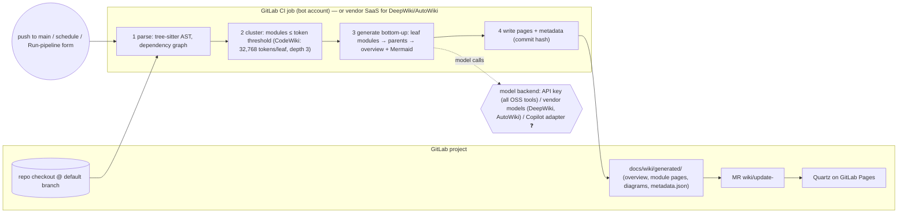

# ADR-05: DeepWiki-style whole-repository wiki generation (Cognition DeepWiki / Devin Wiki, DeepWiki-Open, CodeWiki, OpenDeepWiki, Factory AutoWiki and similar generators)

<!--
Uniform template for all approach ADRs in llm-wiki/approaches/.
Keep ALL headings, in this order, with these numbers. Add sub-sections freely.
Target length: 250-600 lines. Prefer tables and short paragraphs.
Mark unverified claims with ❓ and say what would verify them.
Never invent product features, URLs, or paper titles; if a search finds nothing, say so.
-->

## 1. Summary
Instead of an LLM that *maintains* a wiki incrementally (Karpathy's pattern [1]), a **generator** reads the whole repository, builds a dependency graph, and (re)generates a structured wiki (overview, architecture, module pages, Mermaid diagrams, "Ask" Q&A) on a schedule or per merge. The category was defined by Cognition's DeepWiki (2025-04, "the free public version of Devin Wiki" [2]) and now has several open-source and commercial members: AsyncFuncAI/deepwiki-open (MIT, 17.9k stars) [8], FSoft-AI4Code/CodeWiki (MIT, ACL 2026 paper, incremental `--update`) [18][19], AIDotNet/OpenDeepWiki (.NET, MIT, multi-repo hub with MCP endpoints) [20], Factory AutoWiki (commercial, GitLab CI install, 2026-06-17) [21][22], plus smaller tools (deepwiki-rs/Litho, CodeBoarding) [23][24]. Maturity as of 2026-09: hosted DeepWiki is mature but GitHub-centric and closed; the open tools work but every one of them needs an API key or a vendor account; CodeWiki is the only one with a documented incremental mode and a "subscription mode" that routes through a coding-agent CLI (Claude Code / Codex, **not** Copilot) [18]. **Verdict for us:** as the *maintenance* model it fails R6 outright (no generator can run through GitHub Copilot today without either a reverse-engineered proxy that GitHub does not support, or a custom adapter that does not yet exist) and only partially fits R4/R5/R7; its legitimate role is a **one-off bootstrap accelerator** for legacy repositories inside a hybrid (ADR-01/02/03 for upkeep, ADR-08 for the deterministic backbone), and even that role depends on a two-to-three-day adapter spike (section 11).

## 2. Context
- The owner asked whether a "generate everything from the repo" product can replace the hook-triggered maintenance agent of R4. It is attractive because it removes the human upkeep burden (P24 in `../background/problems-and-fixes.md`) and never suffers lossy compounding (P22): every run re-derives from code.
- R1/R2: generators produce exactly the artefacts agents and developers ask for first (overview, architecture, module pages, diagrams, Q&A). But their agent-usefulness is measured: on SWD-Bench, DeepWiki-style docs scored lowest of the compared documentation methods (47.4 % vs RepoAgent 52.6 %) [53], and on CodeWikiBench CodeWiki beat DeepWiki 68.79 % vs 64.06 %, with OpenDeepWiki at 47.13 % [19] and deepwiki-open at 50.05 % (ADR-08 §12).
- R4: "bootstrap once" is the generator's home turf (P17: the bootstrap is the most expensive and least accurate run; `../background/landscape.md` §4 lists the generators). "Developer-owned upkeep" is where the family breaks: full regeneration has no merge semantics and destroys human edits (P04: DeepWiki has "no path today to hand-edit a page" [6]).
- R6/R7 are the hard constraints. Every generator's model backend and git-host support are enumerated in §3.1 and §4.2; the GitHub terms on third-party use of Copilot are quoted in §4.2.
- Design rules D01–D22 from `../background/problems-and-fixes.md` are applied where a generator is used at all (generator-owned directory, D04 loop prevention, D05 MR gate, D13 unreviewed drafts, D22 licence check).
- Sibling status at writing time: ADR-07/08/10 were complete and are cited; ADR-01/02/03/06 landed in parallel and were only checked for their R6 verdicts (all 🟡 or ✅ on developer-seat routes); ADR-09 (Quartz hub) did not yet exist, so references to it describe the intended option ❓.

## 3. The approach
### 3.1 Origin and provenance

| Generator | Origin / date | Licence, activity (2026-09-02) | Model backend | Git hosts | Incremental? | Human edits |
|---|---|---|---|---|---|---|
| **DeepWiki / Devin Wiki** (hosted) | Cognition, launched 2025-04 [2] | Proprietary SaaS; public repos free ("DeepWiki and deepwiki.com will remain free with the existing generation experience" [5]); private repos need a Devin account; effort levels Low (free), Medium "~5-10 ACUs per wiki", High "~20-40 ACUs per wiki" [3] | Cognition-hosted models only; no BYOK, no Copilot | GitHub documented; the Devin GitLab integration page (GitLab ≥ 15.0, self-managed only on Enterprise) does not mention DeepWiki/Devin Wiki at all [4] ❓ | Regenerates "on a schedule"; "Very active repos may lag `main` by hours to days" [6] | None: "There is no path today to hand-edit a page (e.g. to add a known-gotcha section)" [6]; steering only via `.devin/wiki.json` (include/exclude, repo notes ≤ 10,000 chars, explicit pages ≤ 30, 80 on Enterprise) [3] |
| **deepwiki-open** | AsyncFuncAI, 2025 (issues date from May 2025 [16]) [8] | MIT, 17.9k stars, 2.0k forks [8]. **Warning:** the README now only announces "Deepwiki-Open 2.0 (Grok Wiki is now live)" and points to grok-wiki.com — a macOS-only desktop app (56 stars, Grok/Codex/Claude Code/Pi/Antigravity CLIs, **no Copilot CLI**, no GitLab, no headless mode) [9][17] | "At minimum, you need either `GOOGLE_API_KEY` or `OPENAI_API_KEY`" [10]; also OpenRouter, Azure, Bedrock, DashScope, Ollama; `OPENAI_BASE_URL` for OpenAI-compatible endpoints [11][14] | GitHub, GitLab, Bitbucket by URL; private via PAT pasted in the UI [10]; self-hosted GitLab: open issues #439, #438, #421 (Jan 2026, CORS and URL validation) [15] | No: "Force regeneration will overwrite existing cached documentation" [12] | None (web UI + cache) |
| **CodeWiki** | FPT Software AI Center; arXiv 2510.24428 (v1 2025-10-28, ACL 2026) [19] | MIT, 1.7k stars, 192 commits [18] | OpenAI-compatible (`--base-url`), Atlas Cloud, Anthropic, Bedrock, Azure OpenAI; **subscription mode** `--provider claude-code` or `codex` "uses your existing Claude OAuth login" / "Codex CLI login" [18] | Plain git checkout (host-agnostic); no GitLab mention; `.github/workflows` present [18] | Yes: `--update` = "Incremental update (only regenerate changed modules since last run)"; `--compare-to HASH` for CI/squashed PRs [18] | Output is plain Markdown in `./docs/`; regeneration overwrites; `--instructions TEXT` and `--focus MODULES` for steering [18] |
| **OpenDeepWiki** | AIDotNet, 2025 [20] | MIT, 3.6k stars; ASP.NET Core/.NET 10 + Next.js 16; SQLite/PostgreSQL [20] | `CHAT_API_KEY` + `ENDPOINT` (OpenAI-style) with separate catalog/content model settings [20] | "Git URLs, uploaded ZIP archives, or approved local directories" — host not restricted, GitLab not named [20] | "scheduled incremental updates" as a background worker; details undocumented ❓ [20] | Hosted site per `/{owner}/{repo}`; MCP endpoints `/api/mcp`, `/api/mcp/{owner}/{repo}` [20] |
| **Factory AutoWiki** | Factory.ai, announced 2026-06-17 [21] | Commercial ("available to all plans"); Droid CLI | Factory's own models; CI needs only `FACTORY_API_KEY` [22] | `/install-wiki` "detects your CI framework (GitHub Actions or GitLab CI)"; GitLab job runs `droid exec --auto high "/wiki"` on `$CI_COMMIT_BRANCH == $CI_DEFAULT_BRANCH` [22] | Announcement: subsequent runs "diff against the commit hash stored in the previous wiki's metadata and only regenerate affected pages" [21]; docs page: "regenerates a Wiki every time code is pushed" [22] | `droid-wiki/` in repo; web viewer; GitHub wiki tab sync (GitHub only) [21] |
| deepwiki-rs / Litho | sopaco, Rust [23] | MIT, 1.7k stars | OpenAI-compatible `--llm-api-base-url` + key | Local checkout | Cache + `sync-knowledge --force` | Markdown |
| CodeBoarding | CodeBoarding [24] | MIT, 2.4k stars; diagrams-first | OpenAI/Anthropic/Google/Bedrock/Ollama/OpenRouter/LiteLLM keys | GitHub Action; no GitLab | `incremental` command | `.codeboarding/` Markdown + Mermaid |
| Understand-Anything | Egonex-AI [25] | MIT, 81k stars | **Runs inside Copilot CLI** (`copilot plugin install Egonex-AI/Understand-Anything:understand-anything-plugin`) and VS Code Copilot | Host-agnostic | `/understand --auto-update` post-commit hook; "only changed files are re-analyzed" | JSON knowledge graph `.ua/knowledge-graph.json` + tours; not a human wiki |
| Google "Code Wiki" | Google, codewiki.google | Page is a JS shell; nothing verifiable [26] ❓ | ❓ | ❓ | ❓ | ❓ |

Related but evaluated elsewhere: LangChain OpenWiki (the only generator listing a `copilot` provider and shipping a GitLab CI example) is ADR-06; the research systems RepoAgent/DocAgent/RepoDoc are design references in ADR-08 §3.1.

### 3.2 How it works (architecture)
All members share one pipeline; the differences are where it runs and what it writes.



- **Where the LLM runs:** hosted DeepWiki and AutoWiki call the vendor's models from the vendor's cloud; deepwiki-open, CodeWiki, OpenDeepWiki, deepwiki-rs call whatever endpoint the API key points at [10][18][20][23]. None calls GitHub Copilot.
- **Who authenticates:** a vendor account (Devin, Factory) or a provider API key. CodeWiki's subscription mode piggybacks on a Claude Code or Codex CLI login ("Install the Claude Code CLI and run `claude login` first") [18] — the same trick, applied to Copilot CLI/SDK, is the only conceivable R6-compliant path (§4.2).
- **What triggers a run:** DeepWiki: Cognition's schedule [6]; AutoWiki: push to default branch via installed CI job [22]; OSS CLIs: whatever you wire up (cron, CI, manual).
- **What is written/committed:** CodeWiki writes `overview.md`, `module1.md…`, `module_tree.json`, `metadata.json`, optional `index.html` viewer, and can `--create-branch` [18]; AutoWiki writes `droid-wiki/` [21]; deepwiki-open keeps a server-side cache and serves a web UI [12]; OpenDeepWiki keeps a database and serves a site [20].
- **Method detail (CodeWiki):** "repository analysis with dependency graph construction, recursive documentation generation via specialized agents, and hierarchical assembly synthesizing child documentation into parent-level overviews"; "When module complexity exceeds single-pass capacity, agents delegate sub-modules to specialized sub-agents"; thresholds 32,768 tokens per leaf, delegation depth 3 [19]. deepwiki-open instead embeds the repo and uses RAG both for structure and for the "Ask" chat [13].

### 3.3 Wiki content model it implies
| Aspect | DeepWiki (hosted) | CodeWiki | deepwiki-open | AutoWiki |
|---|---|---|---|---|
| Page types | Overview, architecture, per-area pages with diagrams and source links; "Ask Devin" over the wiki [3] | `overview.md` ("Start here"), one page per module, `module_tree.json` hierarchy, Mermaid "architecture, data flows, dependencies, and sequences" [18] | Wiki pages with Mermaid, RAG "Ask", multi-turn "DeepResearch" [13] | Overview, Architecture, Tech Stack, Project Structure, Entry Points, Systems, Features, reference; ~25 pages in the example; optional narrated MP4 [21] |
| Index / log | Generated navigation; no log | `module_tree.json` + `metadata.json` (commit hash) | Server cache | Metadata with commit hash [21] |
| Frontmatter | none exposed | none documented ❓ (post-process needed for D01) | n/a | not documented ❓ |
| Linking | Source links inside pages [3] | Markdown links between module pages | Web UI links | Web viewer + repo dir |
| Agent-facing vs human-facing | One audience; MCP for agents (public repos only; private via Devin MCP + API key) [7] | Same pages for both; no PO layer | Same | Droid sessions read the wiki [21] |

Implication: the generator family yields a **single-audience technical wiki**. The PO layer (R1), the audience/ownership frontmatter (D01, D20), `index.md`/`log.md` conventions (D06) and the AGENTS.md pointer block (D10) all have to be added by our own post-processing.

### 3.4 Trigger and automation model
| Model | DeepWiki | AutoWiki | CodeWiki / OSS CLIs |
|---|---|---|---|
| Trigger | vendor schedule [6] | push to default branch (installed GitLab CI job) [22] | anything: GitLab `schedule`, `web` (form), `push` on default branch (§4.3) |
| Full vs incremental | full regeneration per schedule | incremental by commit hash (announcement) [21] | `--update` regenerates only changed modules; `--compare-to` when history is squashed [18] |
| Loop prevention | n/a (no commit) | ❓ not documented | ours: bot push with `-o ci.skip` ("Skips the pipeline for this push. Only affects branch pipelines" [47]) + `rules` excluding the bot login (D04) |
| Concurrency | vendor | vendor | one job per project with `resource_group` (GitLab) ❓ standard keyword, not re-verified |
| Merge conflicts | n/a | MR/PR | bot writes only its own directory on a fresh branch and opens an MR via `POST /projects/:id/merge_requests` [48] (D05) |

The structural problem of full regeneration (P19 churn, P04 overwrite) does not disappear with `--update`: CodeWiki's incremental mode regenerates *whole modules*, so a one-line change in a module rewrites that module's page; RepoDoc's finding that incremental updates are cheaper *and* more accurate than full regeneration (−73 % time, −77 % tokens, update recall 97.0 % vs 88.0 %) [51] argues for page-section edits, which no generator offers.

### 3.5 Human retry / instruction channel ("the form")
- **Hosted DeepWiki:** the only channel is the `.devin/wiki.json` file in the repo (repo notes up to 10,000 characters, explicit page definitions) [3] — an edit-and-commit workflow, not a form; regeneration timing is Cognition's.
- **CodeWiki in GitLab CI:** a real form exists for free. GitLab's "Run pipeline" page "displays all pipeline-level variables that have a `description` defined in the `.gitlab-ci.yml` file", with `value` and `options` drop-downs [44]. Map `WIKI_MODE` (update | full | skip), `WIKI_INSTRUCTIONS` (→ `--instructions TEXT`), `WIKI_FOCUS` (→ `--focus MODULES`) [18]. Free text must be treated as untrusted input (D14, P09).
- **AutoWiki:** on-demand `/wiki` in a Droid session, or the Factory app's refresh settings [21][22]; no GitLab-side form.

### 3.6 Multi-repo / microservice fit
- Every generator is **per repository**. Hosted DeepWiki is one wiki per GitHub repo [2]; CodeWiki writes into the repo it analyses [18]; AutoWiki has a batch refresh for many repos (`../background/problems-and-fixes.md` P16) but still one wiki per repo.
- **Cross-repo knowledge (contracts, events, ownership — R3, P23)** is not modelled by any generator; they document what a repo *contains*, not what it *promises* to others. OpenDeepWiki is the closest to a hub: one self-hosted instance serving many repos under `/{owner}/{repo}` with per-repo MCP endpoints [20], but it needs an OpenAI-style endpoint and key (R6 ❌) and its GitLab support is unstated ❓.
- Practical shape for us: per-repo generator output in a fixed directory (§4.4) plus the deterministic aggregate index and hub site from ADR-08/ADR-09; the contract/API/event pages come from ADR-08's backbone, never from the generator.

### 3.7 Publishing / UI
- Hosted DeepWiki and AutoWiki bring their own viewers (deepwiki.com / app.factory.ai) [2][21]; neither serves from GitLab Pages, and DeepWiki's private-repo viewer is behind a Devin login [3].
- CodeWiki's `--github-pages` flag emits an `index.html` interactive viewer [18]; the Markdown itself can be copied into a Quartz content tree and published by a `pages: true` job that publishes `public/` (GitLab Pages, all tiers; Pages Access Control for private projects) [49] — R8 is achievable with post-processing (wikilinks/Mermaid rendering to verify ❓).
- deepwiki-open and OpenDeepWiki are servers (Next.js + backend) rather than static output; hosting them means running a service, not Pages [8][20].

## 4. Concrete implementation sketch for our environment
Assumptions used: GitLab CI runners with Docker and outbound internet; a GitLab bot account with a project access token scoped to `write_repository`; a GitHub machine account with a Copilot Business seat **only if GitHub confirms in writing that this is permitted** (D22; see ADR-08 §5 R6 and `../background/problems-and-fixes.md` P20).

### 4.1 Tool choice
Only **CodeWiki** is a realistic candidate: MIT, CLI on a plain checkout (host-agnostic → GitLab OK), incremental `--update`, steering flags for the form, Python/TypeScript in its top language tier (Python 82.45 %, TypeScript 83.00 % on CodeWikiBench) [18][19]. It is disqualified today only by R6 (no Copilot backend). Hosted DeepWiki fails R6 and (for GitLab-hosted private repos) R7 ❓; deepwiki-open fails R6, is a server, has open self-hosted-GitLab issues and a README that now redirects to a Mac desktop app; OpenDeepWiki fails R6; AutoWiki fails R6 (Factory models) and R7 only partially (GitLab CI yes, wiki-tab sync GitHub-only).

### 4.2 The R6 gate: how a generator could use Copilot, and what GitHub's terms say
**Documented and supported routes (what is allowed).**
- *Copilot CLI programmatic mode.* GitHub: the CLI "allows you to use the CLI programmatically in scripts, CI/CD pipelines, and automation workflows"; example `copilot -p "…" -s --allow-tool='shell(npm:*), write' --no-ask-user` with `COPILOT_GITHUB_TOKEN` [39]; flags `-p`, `-s`, `--no-ask-user`, `--allow-tool`, `--deny-tool`, `--add-dir`, `--model`, `--agent`, `--share`, `--secret-env-vars` [38]. Token: a fine-grained PAT that "Must be owned by your personal account (not an organization) with the Copilot Requests account permission"; classic PAT "Not supported"; env-var tokens are "Recommended for CI/CD pipelines, containers, and non-interactive environments" [40].
- *Copilot SDK (GA 2026-06-02).* Built to "embed GitHub Copilot's agentic engine into your own applications, services, and developer tools", including "CI/CD assistants and internal developer tools"; "available to all existing GitHub Copilot subscribers … and to non-Copilot users via BYOK"; "Billing for the GitHub Copilot SDK is based on the same model as the Copilot CLI, with each prompt being counted towards your usage allowance" [35][36]. Prerequisite: "GitHub Copilot CLI installed and authenticated" [37]. **This is the sanctioned way for a third-party tool to use Copilot as its model backend: through the agent runtime, not as a raw chat-completions endpoint.**
- *Automation caveat.* With a PAT "AI credits are drawn from that user's Copilot seat entitlements", and this "introduces operational and security risks for organizations running automations at scale"; the `GITHUB_TOKEN` alternative "authenticates as an installation" but exists only in GitHub Actions [42]. Machine accounts: "Accounts registered by 'bots' or other automated methods are not permitted", human-created machine accounts for automated tasks are, and "a single login may not be shared by multiple people" [32]. Whether a machine account may hold a Copilot Business seat is not stated anywhere we could read ❓ (same open point as ADR-07/08/10); ADR-03 reports an SDK-documented, org-attributed GitHub App installation-token route for "other CI systems and services" that would sidestep the seat question if it verifies ❓.
- *BYOK* exists ("users can also provide their own LLM keys locally. This is not controlled by enterprise policies" [41]) but is excluded by R6 by definition.

**Undocumented / unsupported routes (what is not allowed, or not allowed *enough*).**
- *OpenAI-compatible proxies over Copilot* (e.g. `ericc-ch/copilot-api`, 4.1k stars) would let deepwiki-open (`OPENAI_BASE_URL` [11]), CodeWiki (`--base-url` [18]) or OpenDeepWiki (`ENDPOINT` [20]) "use Copilot". The project's own disclaimer: "This is a reverse-engineered proxy of GitHub Copilot API. It is not supported by GitHub, and may break unexpectedly. Use at your own risk." Its GitHub Security notice: "Excessive automated or scripted use of Copilot (including rapid or bulk requests, such as via automated tools) may trigger GitHub's abuse-detection systems. You may receive a warning from GitHub Security, and further anomalous activity could result in temporary suspension of your Copilot access." [34]
- *What the terms say.* The GitHub Generative AI Services Terms (governing Copilot Business/Enterprise subscriptions from 2026-03-05) contain no clause naming proxies; they bind use to policy: "Your use of Generative AI Services is subject to the Acceptable Use Policies, the AI Code of Conduct, and the Required Mitigations" (§5.A) and disclaim third-party products: "If you install or use any of these third-party products, you do so at your own risk" (§8.A) [28]. The deprecated Copilot Product Specific Terms (Version March 2026) say the same in §5 and add nothing on proxies [29]. The Acceptable Use Policies prohibit "using our servers for any form of excessive automated bulk activity, to place undue burden on our servers through automated means" and attempts "to gain or to attempt to gain unauthorized access to, any service, device, data, account or network" [31]. The Microsoft AI Code of Conduct (v4.0, 2026-05-01) adds responsible-AI duties for "Autonomous AI Systems" (human oversight, monitoring, transparency) but no clause on client software [33].
- **Honest reading:** no clause *explicitly* forbids an OpenAI-compatible proxy, but the proxy uses undocumented endpoints, is "not supported by GitHub", is enforced against by abuse detection, and sits outside every interface GitHub documents for automation (CLI, SDK, Actions). Under R6's wording ("licence-compliant way") it must be treated as **not allowed** unless GitHub confirms otherwise in writing ❓. A tool that reaches Copilot's model through the CLI/SDK with a seat-holder's token is the compliant pattern; whether *our* seat may be a machine account is the residual question (D22).
- *OpenWiki's `copilot` provider* takes a GitHub OAuth token and notes "Personal Access Tokens (classic or fine-grained) are rejected by the Copilot API for third-party integrations" [27] — i.e. it talks to the Copilot API directly rather than through CLI/SDK; its status under the terms is ADR-06's question, which ADR-06 also rates 🟡 pending written confirmation ❓.

**Consequence for this ADR:** the only R6-compatible design is a **`copilot` subscription-mode provider for CodeWiki** implemented on the Copilot SDK (Python) or `copilot -p` — analogous to its existing `claude-code`/`codex` providers [18]. It does not exist; effort and feasibility are the first spike (§11). Everything below assumes that spike succeeds.

### 4.3 CI job to run the generator (GitLab)
```yaml
# .gitlab-ci.yml (excerpt). Runs on: push to default branch, schedule, or the Run-pipeline form.
variables:
  WIKI_MODE:
    value: "update"
    options: ["update", "full", "skip"]
    description: "update = CodeWiki --update (changed modules only); full = regenerate docs/wiki/generated/ from scratch; skip = no run"
  WIKI_INSTRUCTIONS:
    value: ""
    description: "Optional steering text passed to --instructions. Untrusted input: keep short, no secrets, no URLs."
  WIKI_FOCUS:
    value: ""
    description: "Optional comma-separated module list passed to --focus"

wiki:generate:
  stage: docs
  image: $CI_REGISTRY_IMAGE/wiki-toolbox:1   # Python 3.12 + Node.js + pinned CodeWiki + Copilot CLI ❓ (image to be built)
  resource_group: wiki                        # one run at a time per project
  rules:
    - if: $WIKI_MODE == "skip"
      when: never
    - if: $GITLAB_USER_LOGIN == "wiki-bot"    # D04: the bot's own push never re-triggers
      when: never
    - if: $CI_PIPELINE_SOURCE == "schedule"
    - if: $CI_PIPELINE_SOURCE == "web"
    - if: $CI_PIPELINE_SOURCE == "push" && $CI_COMMIT_BRANCH == $CI_DEFAULT_BRANCH
      changes:
        paths: ["src/**/*", "contracts/**/*", "migrations/**/*", "package.json", "pyproject.toml"]   # never docs/wiki/**
  variables:
    GIT_DEPTH: 0
  before_script:
    - export COPILOT_GITHUB_TOKEN="$WIKI_BOT_COPILOT_TOKEN"     # masked var; fine-grained PAT with "Copilot Requests" [40]; seat/licence per D22 ❓
    - codewiki config set --provider copilot --main-model "$WIKI_MODEL" --cluster-model "$WIKI_MODEL"   # ❓ provider does not exist yet (§4.2, §11)
    - codewiki config validate
  script:
    - |
      if [ "$WIKI_MODE" = "full" ]; then
        codewiki generate --output docs/wiki/generated --verbose \
          ${WIKI_INSTRUCTIONS:+--instructions "$WIKI_INSTRUCTIONS"} ${WIKI_FOCUS:+--focus "$WIKI_FOCUS"}
      else
        codewiki generate --output docs/wiki/generated --update --verbose \
          ${WIKI_INSTRUCTIONS:+--instructions "$WIKI_INSTRUCTIONS"}
      fi
    - python tools/wiki/postprocess.py docs/wiki/generated   # add frontmatter (D01), canonical Markdown (P19), link check, secret scan (D16)
    - |
      git config user.name wiki-bot; git config user.email "wiki-bot@$CI_SERVER_HOST"
      BR="wiki/update-$CI_PIPELINE_ID"; git checkout -b "$BR"
      git add docs/wiki/generated
      git diff --cached --quiet && { echo "no wiki changes"; exit 0; }
      git commit -m "docs(wiki): regenerate ($WIKI_MODE) from $CI_COMMIT_SHORT_SHA"
      git push -o ci.skip "https://wiki-bot:${WIKI_BOT_GITLAB_TOKEN}@${CI_SERVER_HOST}/${CI_PROJECT_PATH}.git" "$BR"   # [47]
      curl --fail -X POST -H "PRIVATE-TOKEN: $WIKI_BOT_GITLAB_TOKEN" \
        "${CI_API_V4_URL}/projects/${CI_PROJECT_ID}/merge_requests" \
        --data-urlencode "source_branch=$BR" --data-urlencode "target_branch=$CI_DEFAULT_BRANCH" \
        --data-urlencode "title=docs(wiki): regenerate ($WIKI_MODE)" --data "remove_source_branch=true"   # [48]
  artifacts:
    paths: [docs/wiki/generated]
    expire_in: 1 week
```
Notes: `CI_PIPELINE_SOURCE` values `push`, `schedule`, `web` are documented [45]; `CI_COMMIT_BEFORE_SHA` is all zeros for scheduled and manual pipelines [46], so `--update` relies on the hash CodeWiki stores in `metadata.json`, and `--compare-to` is used only after squash merges [18]. The Copilot invocation itself (flags, `--deny-tool`, sandboxing) follows ADR-02; if the CI-side seat is not approved, the same job can run the generator from a developer's machine on their own login (ADR-01 pattern), which is licence-clean but not automated.

### 4.4 Output directory layout
```
repo/
├── AGENTS.md                         # managed block: "read docs/wiki/index.md first" (D10, D11)
├── docs/wiki/
│   ├── index.md                      # generated deterministically from frontmatter (D06) — never by the LLM
│   ├── log.md                        # append-only, .gitattributes: merge=union (D06)
│   ├── generated/                    # GENERATOR-OWNED. Overwritten on WIKI_MODE=full; never hand-edited (D09)
│   │   ├── overview.md
│   │   ├── <module>.md …
│   │   ├── module_tree.json          # CodeWiki hierarchy
│   │   └── metadata.json             # commit hash of last generation (drives --update)
│   ├── modules/                      # AGENT/HUMAN-OWNED after handover: owner:, sources:, source_commit:, confidence: (D01)
│   ├── concepts/
│   ├── product/                      # PO-facing pages, owner: human, agent may only append (D20)
│   └── decisions/                    # ADRs, human-owned
├── docs/generated/                   # ADR-08 deterministic backbone (contracts, schemas, catalogue) — no LLM
└── tools/wiki/postprocess.py         # frontmatter injection, formatting, link/secret checks
```
`postprocess.py` stamps every generated page with `owner: generator`, `source_commit: <sha>`, `confidence: unreviewed`, `audience: developer` (D01, D13) and rewrites relative links so Quartz (ADR-09) can render `generated/` and the owned tree side by side.

### 4.5 Bootstrap-then-handover plan
| Phase | What happens | Owner | Exit criterion |
|---|---|---|---|
| 0 Spike (1 week) | Build the `copilot` provider for CodeWiki (§11 Q1); run on one mid-size repo; measure credits, minutes, page quality against 30 repo questions (D19) | platform team | provider works headless in GitLab CI on a bot seat, or the plan stops here |
| 1 Bootstrap (per repo, 1–2 days) | `WIKI_MODE=full`; review MR; developers annotate wrong pages in the MR; PO reads `overview.md` and asks for a plain-language summary | repo team | MR merged with all pages `confidence: unreviewed` |
| 2 Convert (per repo, 1–3 days) | Incremental agent (ADR-01/02/03) moves each generated page into `modules/` or `concepts/`, adds `sources:` citations to code (D12), splits over-long pages, writes `product/` summaries; developers promote pages to `reviewed` | repo team + agent | `generated/` contains only pages nobody has adopted yet |
| 3 Handover | Generator job switched to `WIKI_MODE=skip` by default; upkeep runs through the hook/CI agent on every merge (R4); the form (§3.5) now targets the agent, not the generator | platform team | no writes to `generated/` for 30 days |
| 4 Rebuild-for-comparison (optional, quarterly) | Manual `WIKI_MODE=full` into an artifact only (no MR); a script diffs generator output against the owned pages and files "possible drift" issues (P01 lint) | platform team | list of stale pages, no automatic overwrite |

The point of phase 4 is to keep the generator's one real virtue — re-derivation from code, immune to P22 — as a *lint oracle* rather than as a writer.

## 5. Requirements check
Use exactly these IDs and the legend from `../requirements.md`.

| ID | Requirement (short) | Rating | Evidence / notes |
|----|---------------------|--------|------------------|
| R1 | Dual audience (agents + devs + PO) | 🟡 | Developer-facing pages, diagrams and Q&A are the family's strength [3][18][21]; agent usefulness is measurable but weakest of the compared methods (SWD-Bench: DeepWiki 47.4 %) [53]; no PO layer in any generator — must be added (§3.3, D20). |
| R2 | Context layer for whole AI dev pipeline | 🟡 | Architecture/module/dependency pages cover implementation and review; nothing for operations, contracts, testing strategy or decisions unless combined with ADR-08's backbone. MCP access exists only for hosted DeepWiki public repos [7] or self-hosted OpenDeepWiki [20]. |
| R3 | Multi-repo microservices, future autonomous agents | 🟡 | Per-repo only; no cross-repo contract/event/ownership model (P23). Output is plain Markdown/JSON, so a future agent can consume it; OpenDeepWiki offers a hub with MCP but fails R6 [20]. |
| R4 | Bootstrap once, dev-owned upkeep, hook-triggered auto-update | 🟡 | Bootstrap: strong fit (this is what generators do; CodeWiki handles 86K–1.45M LOC repos [19]). Upkeep: full regeneration is the opposite of developer-owned content; human edits are overwritten (P04) [6]; CodeWiki `--update` and AutoWiki's hash diff [18][21] make CI-triggered refresh possible but still module-granular rewrites. |
| R5 | Human retry / instructions via a form | 🟡 | With CodeWiki in GitLab CI the Run-pipeline form maps to `--instructions`/`--focus`/`WIKI_MODE` [44][18]. Hosted DeepWiki: only `.devin/wiki.json` commits, no form, no retry control [3][6]. |
| R6 | Copilot-only (no API keys, no direct model access) | ❌ | Hosted DeepWiki/AutoWiki use vendor models [3][22]; deepwiki-open, OpenDeepWiki, deepwiki-rs, CodeBoarding need provider keys [10][20][23][24]; CodeWiki has no Copilot provider (subscription mode = Claude Code/Codex) [18]. OpenAI-compatible proxies over Copilot are "not supported by GitHub" and trip abuse detection [34]; the terms route everything to the AUP [28][31]. Only a custom Copilot SDK/CLI adapter (not yet written) would move this to 🟡 (§4.2, §11). |
| R7 | GitLab, not GitHub | 🟡 | CodeWiki/deepwiki-rs run on any checkout [18][23]; AutoWiki installs a GitLab CI job [22]; deepwiki-open supports gitlab.com but self-hosted URLs have open issues [15]; hosted DeepWiki documents GitHub only and its GitLab integration page is silent on wiki generation ❓ [3][4]; AutoWiki's GitHub wiki-tab sync [21] and DeepWiki's public MCP [7] are GitHub-only. |
| R8 | UI on GitLab Pages (Quartz) | 🟡 | CodeWiki Markdown (+ optional `index.html`) can be published via a `pages: true` job [18][49] after link/frontmatter post-processing ❓; hosted DeepWiki/AutoWiki/OpenDeepWiki/deepwiki-open bring their own viewers or servers instead of Pages [2][8][20][21]. |

## 6. Pros
- **Fast, complete first draft.** One command yields overview, module pages, dependency and sequence diagrams for repos up to 1.4 M LOC [18][19]; hosted DeepWiki does it for free on public repos [5]. This is the cheapest way to get past P17's "blank page" on legacy repositories.
- **No lossy compounding.** Every run re-derives from code, so P22 (wiki feeding on itself) cannot occur by construction.
- **Dependency-ordered, hierarchical generation is built in** (CodeWiki bottom-up assembly, AutoWiki "page generation in dependency order") [19][21] — the ordering DocAgent's ablation shows matters most (ADR-08 §2).
- **Incremental modes exist** in the two most capable tools (CodeWiki `--update`, AutoWiki hash diff) [18][21], keeping steady-state cost O(changed modules).
- **Steering without prompt engineering:** `.devin/wiki.json` notes and pages [3]; CodeWiki `--instructions`, `--focus`, `--include/--exclude` [18] — all mappable to a GitLab form.
- **Quality is benchmarked**, which none of the hand-rolled approaches can claim: CodeWikiBench and SWD-Bench numbers exist for exactly these tools [19][53].
- **Optional human-in-the-loop by design** when run from CI into an MR (D05) — the generator never touches `main` directly.

## 7. Cons and risks
- **R6 is unmet by every product in the family.** The only compliant route is custom work on top of Copilot SDK/CLI, whose licensing for a bot seat is itself unresolved (P20, D22). A proxy "solution" risks Copilot suspension for the whole org's bot account [34].
- **Full regeneration destroys human edits and instruction-file changes** (P04): DeepWiki "no path today to hand-edit a page" [6]; CodeWiki/AutoWiki overwrite their output directories. Requires the generator-owned/agent-owned split of §4.4 and the handover of §4.5, at which point the generator is no longer the maintainer.
- **Drift by design when scheduled:** "Very active repos may lag `main` by hours to days" [6]; stale docs are worse than none for agents (landscape §7d P27).
- **Churn (P19):** module-level rewrites produce large, noisy MRs that reviewers stop reading; pin the model (D21) and canonicalise formatting.
- **Hallucinated architecture** (P02): HN reports of DeepWiki diagrams "based on some cherry-picked filenames" [54]; "Heavy metaprogramming, code generation and unusual architectures are the most common misinterpretation cases" [6]; CodeWiki's own paper admits its rubrics "have not undergone comprehensive human validation" [19].
- **No PO layer, no cross-repo layer, no ownership metadata** — everything R1/R3/D01 need on top is our post-processing.
- **Project stability:** deepwiki-open's README now redirects to a Mac-only desktop app with no headless mode [9][17]; CodeWiki is a research codebase (192 commits) [18]; Google Code Wiki cannot even be read [26]. Hosted DeepWiki's private-repo wiki for GitLab is unverified ❓ [4].
- **Data residency / vendor exposure:** hosted DeepWiki and AutoWiki upload the whole codebase to a third-party SaaS (P20, R6's "no third-party LLM SaaS").
- **Cost spikes on bootstrap** (P08): DeepWiki High effort "~20-40 ACUs per wiki" [3]; large repos take "10–30 minutes" in deepwiki-open [12] and hit rate limits and memory kills (§8).

## 8. Known problems reported by practitioners, and fixes
| Problem (ID) | Evidence | Fix / mitigation |
|---|---|---|
| Wiki lags the code (P01) | "Cognition regenerates wikis on a schedule. Very active repos may lag `main` by hours to days." [6] | Trigger per merge to default branch from GitLab CI (§4.3, D07); freshness stamped in frontmatter (D01); stale-page lint oracle (§4.5 phase 4). |
| Cannot hand-edit; human context lost (P04) | "There is no path today to hand-edit a page (e.g. to add a known-gotcha section)." [6] | Generator-owned directory only; adopted pages move to agent/human-owned tree; CI fails MRs where the bot touches `owner: human` files (D09). |
| Hallucinated diagrams / wrong call paths (P02) | HN on DeepWiki: "'architecture' diagrams based on some cherry-picked filenames" [54]; "Heavy metaprogramming, code generation and unusual architectures are the most common misinterpretation cases" [6] | Every claim must cite a code path (D12); bootstrap pages are `confidence: unreviewed` until a human promotes them (D13); deterministic backbone for facts (ADR-08). |
| Large repos: timeouts, kills, rate limits (P17, P08) | deepwiki-open issues: "Failed to fetch repository (process killed)" #315; "rate_limit_exceeded error when analyzing local repository with OpenAI model" #166; "Handling of files larger than MAX_EMBEDDING_TOKENS (8192)" #81 [16]; DeepWiki: "Cognition imposes generation-size limits. Very large monorepos may need `.devin/wiki.json` tuning to exclude generated code, vendored deps, etc." [6] | Exclude vendored/generated code (`--exclude`, `.gitignore` honoured by CodeWiki [18]); run per module cluster and commit per cluster so a failed run resumes (ADR-08 §4.10); separate bootstrap budget (D17). |
| Self-hosted GitLab not recognised (R7) | deepwiki-open open issues "[GitLab] Unable to get the output even with perfect URL" #439, "[GitLab] The repository input needs to be broadend" #438, "Internal Gitlab repository encountered cross domain issues during addition" #421 [15] | Prefer checkout-based CLIs (CodeWiki, deepwiki-rs) that never talk to the GitLab API. |
| Quality collapse on systems languages | CodeWiki: high-level languages average 79.14 %, C/C++ 53.24 % [19] | Irrelevant for Python/TypeScript; gate any C/C++ repo behind human review. |
| Generated docs help agents less than hoped (R1) | SWD-Bench: DeepWiki 47.4 % < AutoDoc/DocAgent 49.1 % < RepoAgent 52.6 %; docs "demonstrate limited navigation ability" [53] | Evaluate with task-based QA (D19); keep pages task-shaped and pointer-rich rather than narrative. |
| Noisy regeneration diffs (P19) | Inherent to module-level rewrites; Copilot's default model "can change over time" (`../background/problems-and-fixes.md` P19) | `--model` pinned (D21); Prettier-style canonical formatting in `postprocess.py`; reject MRs with high changed-line ratio on unchanged sources. |
| Proxy use trips abuse detection (P20) | copilot-api: "may trigger GitHub's abuse-detection systems … temporary suspension of your Copilot access" [34] | Do not use proxies; adapter via SDK/CLI only; written confirmation from GitHub (D22). |
| Tool pivots / abandonment | deepwiki-open README replaced by "Deepwiki-Open 2.0 (Grok Wiki is now live)" pointing at a macOS app [9][17] | Pin a commit; vendor the tool into a toolbox image; keep the output format tool-independent (OKF/ADR-07) so the generator is replaceable. |

## 9. Scaling considerations
| Dimension | Numbers found | Implication |
|---|---|---|
| Time per run | deepwiki-open: "Smaller repos take 30 seconds to 2 minutes, while larger ones may take 5-10 minutes" [10]; "10–30 minutes for large ones" [12]. CodeWiki/AutoWiki/DeepWiki: no wall-clock figures published ❓ | Fine for CI on merge; too slow for a synchronous hook (P07, D02). |
| Cost per full run | DeepWiki Medium "~5-10 ACUs", High "~20-40 ACUs" per wiki [3] (ACU price for Enterprise not published in the plan post; self-serve overage "priced in dollars rather than ACUs" [5]) ❓. Research baselines: RepoAgent 2.7K–4.1M prompt tokens per repo; RepoDoc $0.39–2.66 per repo for full generation [51][52]. CodeWiki paper reports no cost/tokens [19]. | Under Copilot billing (1 AI credit = $0.01; Business 1,900 credits/user/month pooled, promotional 3,000 until 2026-09-01; CLI/SDK billed by tokens [43]) a multi-million-token bootstrap of a large repo can consume a seat's month in one run — budget it separately (D17). |
| Incremental vs full | CodeWiki `--update` regenerates changed modules only [18]; AutoWiki diffs against the stored commit hash [21]; RepoDoc: incremental −73 % time, −77 % tokens, update recall 97.0 % vs 88.0 % [51] | Full regeneration is a recovery tool, not a quality lever (ADR-08 §9); module-granular incremental is still coarser than section edits. |
| Repository size | CodeWiki evaluated 86K–1,446,730 LOC; leaf modules capped at 32,768 tokens, delegation depth 3 [19]; DeepWiki explicit pages ≤ 30 (80 Enterprise) [3]; deepwiki-open embedding limit 8,192 tokens per file [16] | Monorepos need exclusions and clustering; page-count caps in hosted products limit depth. |
| Many repos | One wiki per repo everywhere; AutoWiki batch refresh; OpenDeepWiki hub [20] | Aggregation is ours (ADR-09 hub + ADR-08 catalogue); generator runs scale linearly in credits. |
| Drift detection | Scheduled full regeneration = periodic drift *reset*, not detection; no generator tracks per-page sources | Use the generator as a quarterly lint oracle (§4.5) and ADR-08's hash manifest for detection. |
| Evaluation | CodeWikiBench (rubrics, multi-judge) and SWD-Bench (agent task success) are reusable methods [19][53] | Adopt as the D19 monthly evaluation regardless of approach. |

## 10. Effort and cost estimate
| Item | Estimate | Notes |
|------|----------|-------|
| Bootstrap (one-off) | Spike 3–5 person-days (Copilot provider for CodeWiki + toolbox image + `postprocess.py`); then 1–2 days per repo to run, review and annotate; LLM cost per mid-size repo ≈ 0.5–4 M tokens (RepoAgent/RepoDoc order of magnitude [51][52]) → several hundred to a few thousand AI credits ($3–30) depending on model ❓ | Only meaningful if the spike succeeds; otherwise the bootstrap is done by the ADR-02/08 Copilot CLI pipeline instead. Hosted alternative: Devin Teams $80/month minimum + ACUs [5], fails R6/R7. |
| Per-commit / per-MR run | `--update`: minutes, tokens O(changed modules); no-op exits free (D07) | Only until handover (§4.5 phase 3); afterwards the incremental agent (ADR-01/02/03) runs instead. |
| Ongoing maintenance per week | 0.5 day during bootstrap phase (MR review, exclusions, tool pinning); ~0 after handover except quarterly rebuild-for-comparison | Tool churn risk (deepwiki-open pivot) adds occasional re-pinning. |
| Infrastructure | Existing GitLab runners; one toolbox image; Pages job (ADR-09) | No servers (deepwiki-open/OpenDeepWiki would need one — not chosen). |
| Licensing / seats | One Copilot Business seat for the bot **if** GitHub confirms machine-account seats (D22) ❓; otherwise developers run the bootstrap on their own seats | No third-party SaaS subscriptions under R6. |

## 11. Open questions and spike plan
| # | Question | Smallest experiment |
|---|---|---|
| Q1 | Can CodeWiki be given a `copilot` subscription-mode provider that runs headless in GitLab CI? | Fork CodeWiki; implement the provider on the Copilot SDK (Python) mirroring the `claude-code` provider [18][35]; run `codewiki generate` on one mid-size Python repo in a GitLab job with `COPILOT_GITHUB_TOKEN`; record credits, minutes, failures. 2–3 days. Stop the ADR if it fails. |
| Q2 | May a machine account hold a Copilot Business seat and drive CLI/SDK from a non-GitHub CI (D22)? | Written question to the GitHub account manager, quoting [32][40][42]; in parallel the ADR-08 §11 spike. Shared with ADR-01/02/03/08. |
| Q3 | Is any *direct* Copilot API use by third-party tools (OpenWiki's provider, proxies) permitted? | Same written question; until answered, treat as not allowed. |
| Q4 | Does Devin Enterprise generate DeepWiki for GitLab-hosted private repos? | Ask Cognition sales; irrelevant under R6 but closes the R7 ❓ [4]. |
| Q5 | Is generator output good enough on *our* repos to be worth adopting versus writing pages with the ADR-02 agent directly? | Run DeepWiki (free) on 2–3 public OSS repos that resemble our stack and score them with 30 task questions (D19); no keys needed. 1 day. |
| Q6 | Do CodeWiki pages render in Quartz (links, Mermaid) and survive frontmatter injection? | Feed a sample `docs/` output through `postprocess.py` and the ADR-09 Pages job. 1 day. |
| Q7 | How does `--update` behave on module renames/moves and squash merges? | Rename a module, squash-merge, run `--update` and `--compare-to`; inspect `metadata.json` and diff size. 0.5 day. |

## 12. Verdict
**Fit score 3/10.** As the *maintenance* model, whole-repo generators contradict R4's "developer-owned upkeep" (full regeneration overwrites people), fail R6 for every existing product (vendor models or API keys; proxies unsupported by GitHub [34]), and fit R7 only for the checkout-based CLIs. Their real value is narrower and genuine: a benchmarked, dependency-ordered **bootstrap** that gets a legacy repository from nothing to a reviewable draft in one CI run, and a periodic **re-derivation oracle** that catches drift without ever writing to the owned wiki.

Choose this approach only as **phase 1 of a hybrid**, and only if spike Q1 shows CodeWiki can run through the Copilot SDK/CLI on a licensed seat. If Q1 fails, do not fall back to a proxy; instead implement CodeWiki's algorithm (tree-sitter clustering, 32K-token leaves, bottom-up assembly [19]) as a Copilot CLI custom agent inside the ADR-02/ADR-08 pipeline, which needs no foreign tool.

Combines with: ADR-01/ADR-02/ADR-03 (incremental upkeep after handover — the generator's output directory is their starting inventory), ADR-08 (deterministic backbone supplies the facts generators hallucinate; its hash manifest supplies drift detection), ADR-07 (store adopted pages in OKF-style frontmatter so the generator is replaceable), ADR-09 (Quartz hub publishes `generated/` and owned pages together), ADR-06 (OpenWiki is the one generator with a Copilot provider and a GitLab CI example; if its provider is ruled compliant it displaces CodeWiki in this plan). Not recommended: hosted DeepWiki or AutoWiki for private code (R6, data residency), deepwiki-open/OpenDeepWiki as services (R6, extra infrastructure, stability).

## 13. Sources
Tags: `[fetched]` = opened in this session; `[snippet]` = not opened here, taken from a sibling document that fetched it (file and ID given); `[memory]` = not verified online.

1. Andrej Karpathy, "LLM Wiki" gist, 2026-04-04 — pattern of raw sources / LLM-owned wiki / schema, ingest-query-lint. Via `../background/landscape.md` §1 [S1]. [snippet]
2. Cognition, "DeepWiki" launch post, 2025-05-05, https://cognition.com/blog/deepwiki — "the free public version of Devin Wiki and Devin Search", 50,000+ public repos. Via `../background/landscape.md` [S52]. [snippet]
3. Devin docs, "DeepWiki for Private Repositories", https://docs.devin.ai/work-with-devin/deepwiki — private repos need Devin; effort levels Low free / Medium "~5-10 ACUs per wiki" / High "~20-40 ACUs per wiki"; `.devin/wiki.json` (repo notes ≤ 10,000 chars, explicit pages ≤ 30, 80 Enterprise); only GitHub named; no refresh cadence. [fetched]
4. Devin docs, "GitLab integration", https://docs.devin.ai/integrations/gitlab — GitLab ≥ 15.0, self-managed on Enterprise only, dedicated GitLab account for Devin, daily MR-status sync on-prem; no mention of DeepWiki/Devin Wiki. [fetched]
5. Cognition, "New self-serve plans for Devin", 2026-04-14, https://cognition.com/blog/new-self-serve-plans-for-devin — Free / Pro $20 / Max $200 / Teams $80 min / Enterprise; "DeepWiki and deepwiki.com will remain free with the existing generation experience"; overage "priced in dollars rather than ACUs"; no GitLab mention. [fetched]
6. Codersera, "DeepWiki Complete Guide (2026)", 2026-05-23, https://codersera.com/blog/deepwiki-complete-guide-2026/ — schedule lag "hours to days", "no path today to hand-edit a page", generation-size limits, misinterpretation cases, `.devin/wiki.json` keys, MCP. [fetched]
7. Devin docs, "DeepWiki MCP", https://docs.devin.ai/work-with-devin/deepwiki-mcp — public repos only; private via Devin MCP + API key. Via `../background/landscape.md` [S55]. [snippet]
8. AsyncFuncAI/deepwiki-open repository page, https://github.com/AsyncFuncAI/deepwiki-open — MIT, 17.9k stars, 2.0k forks, GitHub/GitLab/Bitbucket, Docker variants (litellm, ollama). [fetched]
9. deepwiki-open README (raw, main), https://raw.githubusercontent.com/AsyncFuncAI/deepwiki-open/main/README.md — now a short notice "Deepwiki-Open 2.0 (Grok Wiki is now live)" with download at grok-wiki.com; five-step feature list; MIT. [fetched]
10. DeepWiki-Open docs, "Quick Start", https://asyncfunc.mintlify.app/getting-started/quick-start — "At minimum, you need either `GOOGLE_API_KEY` or `OPENAI_API_KEY`"; GitLab public by URL, private via pasted PAT; "Smaller repos take 30 seconds to 2 minutes, while larger ones may take 5-10 minutes". [fetched]
11. DeepWiki-Open docs, "Environment Variables", https://asyncfunc.mintlify.app/getting-started/environment-variables — `OPENAI_BASE_URL` (OpenAI-compatible endpoint), provider keys, `DEEPWIKI_AUTH_MODE/CODE`, `DEEPWIKI_CONFIG_DIR`, `REDIS_URL`. [fetched]
12. DeepWiki-Open docs, "Wiki Generation", https://asyncfunc.mintlify.app/guides/wiki-generation — "Force regeneration will overwrite existing cached documentation"; 10–30 minutes for large repos. [fetched]
13. DeepWiki-Open docs index, https://asyncfunc.mintlify.app/ — Ask (RAG), DeepResearch, provider list incl. Bedrock and DashScope. [fetched]
14. deepwiki-open `api/config/generator.json`, https://raw.githubusercontent.com/AsyncFuncAI/deepwiki-open/main/api/config/generator.json — providers dashscope, google (default), openai, openrouter, ollama, bedrock, azure. [fetched]
15. deepwiki-open issues mentioning GitLab, https://github.com/AsyncFuncAI/deepwiki-open/issues?q=is%3Aissue+gitlab and issue #439 — #451, #439, #438, #421 open (Dec 2025–Jan 2026), #382 closed; #439 error "Please check that your repository exists and is public". [fetched]
16. deepwiki-open issues on large repositories, https://github.com/AsyncFuncAI/deepwiki-open/issues?q=is%3Aissue+large+repository — #445, #315, #298, #166, #81 (open), #252 (closed). [fetched]
17. Grok Wiki site and repo, https://grok-wiki.com/ and https://github.com/AsyncFuncAI/grok-wiki — macOS desktop app, 56 stars, agents Grok/Codex/Claude Code/Pi/Antigravity CLIs (no Copilot CLI), GitHub repos and local paths, no headless mode. [fetched]
18. FSoft-AI4Code/CodeWiki README and repository page, https://github.com/FSoft-AI4Code/CodeWiki — MIT, 1.7k stars, 192 commits; `pip install git+…`; providers incl. OpenAI-compatible `--base-url`; subscription mode `--provider claude-code|codex`; `generate` flags `--update`, `--compare-to`, `--create-branch`, `--github-pages`, `--include/--exclude`, `--focus`, `--instructions`; output layout; Mermaid diagram types; no GitLab mention. [fetched]
19. Nguyen Hoang, Le-Anh, Le, Bui, "CodeWiki: Evaluating AI's Ability to Generate Holistic Documentation for Large-Scale Codebases", arXiv 2510.24428 (v1 2025-10-28; ACL 2026), https://arxiv.org/html/2510.24428 — three-phase architecture, 32,768-token leaves, depth 3; CodeWikiBench 68.79 % vs DeepWiki 64.06 %, OpenDeepWiki 47.13 %; per-language results; repos 86K–1,446,730 LOC; no cost/time reported. [fetched]
20. AIDotNet/OpenDeepWiki repository and README, https://github.com/AIDotNet/OpenDeepWiki — MIT, 3.6k stars, .NET 10 + Next.js 16, `CHAT_API_KEY`/`ENDPOINT`/`CHAT_REQUEST_TYPE`, sources "Git URLs, uploaded ZIP archives, or approved local directories", "scheduled incremental updates", MCP endpoints `/api/mcp`, `/api/mcp/{owner}/{repo}`. [fetched]
21. Factory.ai, "AutoWiki" announcement, 2026-06-17, https://factory.ai/news/wiki — multi-phase generation in dependency order, incremental "diff against the commit hash stored in the previous wiki's metadata and only regenerate affected pages", `/install-wiki` for GitHub Actions and GitLab CI, `droid-wiki/`, four surfaces, "available to all plans". [fetched]
22. Factory docs, "AutoWiki auto-refresh", https://docs.factory.ai/cli/features/wiki/auto-refresh — GitLab CI job with `$CI_COMMIT_BRANCH == $CI_DEFAULT_BRANCH`, `droid exec --auto high "/wiki"`, `FACTORY_API_KEY` secret. [fetched]
23. sopaco/deepwiki-rs (Litho), https://github.com/sopaco/deepwiki-rs — MIT, 1.7k stars, `--llm-api-base-url`, local checkout, hierarchical output, cache. [fetched]
24. CodeBoarding/CodeBoarding, https://github.com/CodeBoarding/CodeBoarding — MIT, 2.4k stars, provider keys, GitHub Action, `incremental` command, `.codeboarding/`. [fetched]
25. Egonex-AI/Understand-Anything README, https://raw.githubusercontent.com/Egonex-AI/Understand-Anything/main/README.md — Copilot CLI plugin install command, JSON knowledge graph, `--auto-update` post-commit hook, incremental re-analysis. [fetched]
26. Google "Code Wiki", https://codewiki.google/ — page delivered only a "Code Wiki" shell; no product details could be read, so nothing about it is relied on in this ADR ❓. [fetched]
27. LangChain docs, "OpenWiki model providers", https://docs.langchain.com/oss/openwiki/providers — `OPENWIKI_PROVIDER=copilot`, `COPILOT_API_KEY` OAuth token, "Personal Access Tokens (classic or fine-grained) are rejected by the Copilot API for third-party integrations". [fetched]
28. GitHub, "GitHub Generative AI Services Terms", https://github.com/customer-terms/github-generative-ai-services-terms — §5.A acceptable use; §8.A third-party products at your own risk; §2/§3 ownership and no training. [fetched]
29. GitHub, "GitHub Copilot Product Specific Terms", Version March 2026, deprecated 2026-03-05 (PDF via assets.ctfassets.net; https://github.com/customer-terms/github-copilot-product-specific-terms redirects to the new terms) — §5 Acceptable Use text; §6.B.1 CLI prompts retained; definitions pointing to gh.io/aup and aka.ms/AIcode. [fetched]
30. GitHub Docs, "GitHub Terms for Additional Products and Features", https://docs.github.com/en/site-policy/github-terms/github-terms-for-additional-products-and-features — Business/Enterprise governed by the Product Specific Terms; others by ToS Section J. [fetched]
31. GitHub Docs, "GitHub Acceptable Use Policies", https://docs.github.com/en/site-policy/acceptable-use-policies/github-acceptable-use-policies — excessive automated bulk activity; unauthorized access. [fetched]
32. GitHub Docs, "GitHub Terms of Service", https://docs.github.com/en/site-policy/github-terms/github-terms-of-service — B.3 bots not permitted, machine accounts permitted, one login per person; Section J AI features. [fetched]
33. Microsoft, "Code of Conduct for Microsoft AI Services", v4.0 2026-05-01, https://learn.microsoft.com/en-us/legal/ai-code-of-conduct — Autonomous AI Systems requirements; no client-software clause. [fetched]
34. ericc-ch/copilot-api, https://github.com/ericc-ch/copilot-api — 4.1k stars, MIT; disclaimer "reverse-engineered proxy … not supported by GitHub"; GitHub Security notice on abuse detection and temporary suspension. [fetched]
35. github/copilot-sdk README, https://github.com/github/copilot-sdk — six languages, JSON-RPC to Copilot CLI, auth via signed-in user / `COPILOT_GITHUB_TOKEN`/`GH_TOKEN`/`GITHUB_TOKEN` / GitHub App / BYOK; subscription mandatory unless BYOK; billing same as CLI; MIT. [fetched]
36. GitHub Changelog, "Copilot SDK is now generally available", 2026-06-02, https://github.blog/changelog/2026-06-02-copilot-sdk-is-now-generally-available/ — intended uses incl. "CI/CD assistants and internal developer tools"; available to all subscribers incl. Free, BYOK for non-subscribers. [fetched]
37. github/copilot-sdk, "Getting started", https://github.com/github/copilot-sdk/blob/main/docs/getting-started.md — prerequisite "GitHub Copilot CLI installed and authenticated". [fetched]
38. GitHub Docs, "GitHub Copilot CLI programmatic reference", https://docs.github.com/en/copilot/reference/copilot-cli-reference/cli-programmatic-reference — flags and token precedence. [fetched]
39. GitHub Docs, "Running GitHub Copilot CLI programmatically", https://docs.github.com/en/copilot/how-tos/copilot-cli/automate-copilot-cli/run-cli-programmatically — scripts/CI/automation statement, example, least-privilege warning. [fetched]
40. GitHub Docs, "Authenticate Copilot CLI", https://docs.github.com/en/copilot/how-tos/copilot-cli/set-up-copilot-cli/authenticate-copilot-cli — token types; fine-grained PAT with "Copilot Requests"; classic PAT unsupported; CI recommendation. [fetched]
41. GitHub Docs, "Administering Copilot CLI for your enterprise", https://docs.github.com/en/copilot/how-tos/copilot-cli/administer-copilot-cli-for-your-enterprise — policies; "users can also provide their own LLM keys locally. This is not controlled by enterprise policies." [fetched]
42. GitHub Docs, "Copilot CLI in GitHub Actions", https://docs.github.com/en/copilot/concepts/agents/copilot-cli/copilot-cli-in-github-actions — PAT draws from the user's seat; "operational and security risks for organizations running automations at scale"; `GITHUB_TOKEN` as installation; Agentic Workflows recommended. [fetched]
43. GitHub Docs, "Usage-based billing for organizations and enterprises", https://docs.github.com/en/copilot/concepts/billing/usage-based-billing-for-organizations-and-enterprises — Business 1,900 / Enterprise 3,900 AI credits per user per month (promo 3,000 / 7,000 to 2026-09-01), 1 credit = $0.01, pooled, CLI billed by tokens, CLI ≥ 1.0.48. [fetched]
44. GitLab Docs, "CI/CD pipelines" (prefill variables in manual pipelines), https://docs.gitlab.com/ci/pipelines/ — `description`, `value`, `options`; New pipeline page shows described variables. [fetched]
45. GitLab Docs, "Job rules" (`CI_PIPELINE_SOURCE` values), https://docs.gitlab.com/ci/jobs/job_rules/ — `push`, `schedule`, `web`, `api`, `trigger`, `merge_request_event`, … [fetched]
46. GitLab Docs, "Predefined variables", https://docs.gitlab.com/ci/variables/predefined_variables/ — `CI_COMMIT_BEFORE_SHA` zeros for scheduled/manual pipelines; `GITLAB_USER_LOGIN`; `CI_JOB_TOKEN`. [fetched]
47. GitLab Docs, "Push options", https://docs.gitlab.com/topics/git/commit/ — `ci.skip` "Skips the pipeline for this push. Only affects branch pipelines, not merge request pipelines"; `merge_request.*` options. [fetched]
48. GitLab Docs, "Merge requests API", https://docs.gitlab.com/api/merge_requests/ — `POST /projects/:id/merge_requests` with `source_branch`, `target_branch`, `title`, `remove_source_branch`. [fetched]
49. GitLab Docs, "GitLab Pages", https://docs.gitlab.com/user/project/pages/ — `pages: true` job publishing `public/`; Pages Access Control; all tiers; `path_prefix`. [fetched]
50. GitLab Docs, "Scheduled pipelines", https://docs.gitlab.com/ci/pipelines/schedules/ — creation, per-schedule variables, instance frequency limit. [fetched]
51. Xu et al., "RepoDoc: A Knowledge Graph-Based Framework to Automatic Documentation Generation and Incremental Updates", arXiv 2604.26523, 2026-04-29 — incremental −73 % time / −77 % tokens, update recall 97.0 % vs 88.0 %, $0.39–2.66 per repo. Via ADR-08 [S5]. [snippet]
52. Luo et al., "RepoAgent", arXiv 2402.16667, 2024-02 — 2.7K–4.1M prompt tokens per repository. Via ADR-08 [S2]. [snippet]
53. Wang et al., "Evaluating Repository-level Software Documentation via Question Answering and Feature-Driven Development (SWD-Bench)", arXiv 2604.06793, 2026-04-08 — RepoAgent 52.6 % > DocAgent = AutoDoc 49.1 % > DeepWiki 47.4 %; "limited navigation ability". Via `../background/landscape.md` §7b P10 and `../background/problems-and-fixes.md` [S43]. [snippet]
54. Hacker News thread on Karpathy's LLM Wiki (296 points), commenter "Lockal" on DeepWiki: "'architecture' diagrams based on some cherry-picked filenames". Via `../background/problems-and-fixes.md` P02 [S2]. [snippet]
55. Yang et al., "DocAgent", arXiv 2504.08725, ACL 2025 — dependency-ordered generation ablation (+7.9 pp truthfulness). Via ADR-08 [S3]. [snippet]
